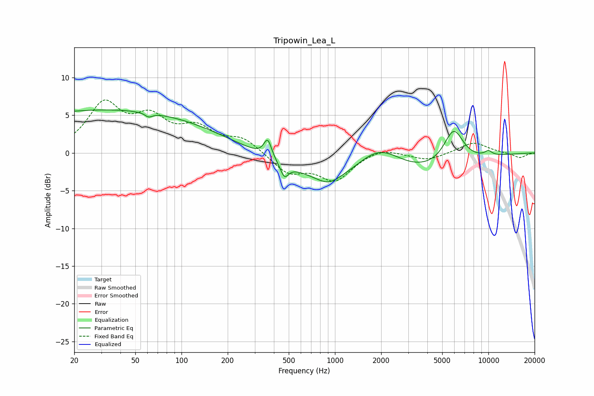

# Tripowin_Lea_L
See [usage instructions](https://github.com/jaakkopasanen/AutoEq#usage) for more options and info.

### Parametric EQs
Apply preamp of -5.8 dB when using parametric equalizer.

|   # | Type    |   Fc (Hz) |    Q |   Gain (dB) |
|-----|---------|-----------|------|-------------|
|   1 | Peaking |        20 | 5.58 |         0   |
|   2 | Peaking |        33 | 0.18 |         5.7 |
|   3 | Peaking |        61 | 5.95 |        -0.6 |
|   4 | Peaking |       365 | 5.65 |         2.4 |
|   5 | Peaking |       468 | 5.39 |        -1.8 |
|   6 | Peaking |       909 | 1.8  |        -1.3 |
|   7 | Peaking |      1668 | 0.29 |        -5   |
|   8 | Peaking |      1937 | 0.88 |         5   |
|   9 | Peaking |      5931 | 2.15 |         4.6 |
|  10 | Peaking |     10000 | 4.8  |         0.6 |

### Fixed Band EQs
When using fixed band (also called graphic) equalizer, apply preamp of **-7.1 dB** (if available) and set gains manually with these parameters.

|   # | Type    |   Fc (Hz) |    Q |   Gain (dB) |
|-----|---------|-----------|------|-------------|
|   1 | Peaking |        31 | 1.41 |         6.2 |
|   2 | Peaking |        62 | 1.41 |         3.9 |
|   3 | Peaking |       125 | 1.41 |         2.8 |
|   4 | Peaking |       250 | 1.41 |         1.8 |
|   5 | Peaking |       500 | 1.41 |        -2.6 |
|   6 | Peaking |      1000 | 1.41 |        -3.5 |
|   7 | Peaking |      2000 | 1.41 |         0.8 |
|   8 | Peaking |      4000 | 1.41 |        -1   |
|   9 | Peaking |      8000 | 1.41 |         1.4 |
|  10 | Peaking |     16000 | 1.41 |        -0.7 |

### Graphs

