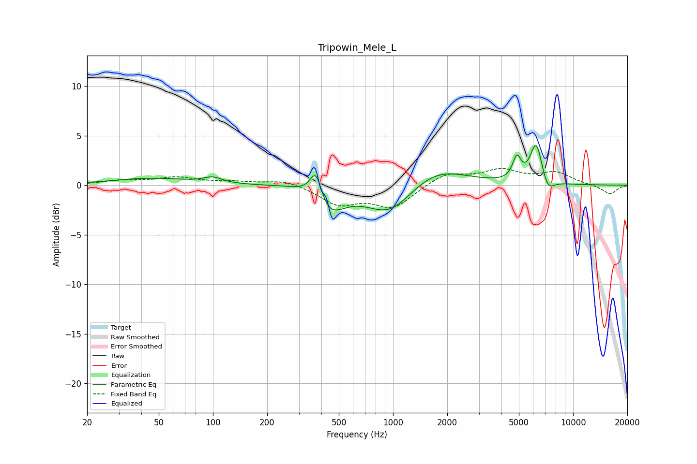

# Tripowin_Mele_L
See [usage instructions](https://github.com/jaakkopasanen/AutoEq#usage) for more options and info.

### Parametric EQs
Apply preamp of -4.1 dB when using parametric equalizer.

|   # | Type    |   Fc (Hz) |    Q |   Gain (dB) |
|-----|---------|-----------|------|-------------|
|   1 | Peaking |        46 | 0.66 |         0.7 |
|   2 | Peaking |       100 | 2.86 |         0.6 |
|   3 | Peaking |       351 | 1.18 |         0.9 |
|   4 | Peaking |       374 | 4.17 |         3.3 |
|   5 | Peaking |       427 | 1.6  |        -3.5 |
|   6 | Peaking |       959 | 1.09 |        -3.1 |
|   7 | Peaking |      1728 | 0.85 |         2   |
|   8 | Peaking |      4872 | 6    |         2.2 |
|   9 | Peaking |      6241 | 4.1  |         4.1 |
|  10 | Peaking |      7234 | 4.06 |        -1.4 |

### Fixed Band EQs
When using fixed band (also called graphic) equalizer, apply preamp of **-1.8 dB** (if available) and set gains manually with these parameters.

|   # | Type    |   Fc (Hz) |    Q |   Gain (dB) |
|-----|---------|-----------|------|-------------|
|   1 | Peaking |        31 | 1.41 |         0.4 |
|   2 | Peaking |        62 | 1.41 |         0.7 |
|   3 | Peaking |       125 | 1.41 |         0.3 |
|   4 | Peaking |       250 | 1.41 |         0.6 |
|   5 | Peaking |       500 | 1.41 |        -1.8 |
|   6 | Peaking |      1000 | 1.41 |        -2.2 |
|   7 | Peaking |      2000 | 1.41 |         1.2 |
|   8 | Peaking |      4000 | 1.41 |         1.4 |
|   9 | Peaking |      8000 | 1.41 |         1.2 |
|  10 | Peaking |     16000 | 1.41 |        -0.9 |

### Graphs

