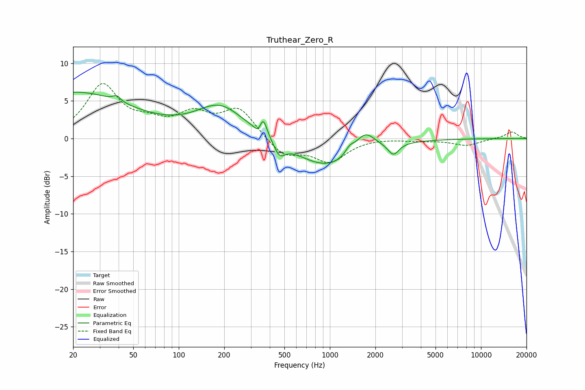

# Truthear_Zero_R
See [usage instructions](https://github.com/jaakkopasanen/AutoEq#usage) for more options and info.

### Parametric EQs
Apply preamp of -6.2 dB when using parametric equalizer.

|   # | Type    |   Fc (Hz) |    Q |   Gain (dB) |
|-----|---------|-----------|------|-------------|
|   1 | Peaking |        20 | 0.37 |         6.1 |
|   2 | Peaking |        39 | 6    |         0.7 |
|   3 | Peaking |       188 | 0.89 |         4.2 |
|   4 | Peaking |       340 | 5.9  |        -1.3 |
|   5 | Peaking |       360 | 5.41 |         2.8 |
|   6 | Peaking |       464 | 3.82 |        -1.8 |
|   7 | Peaking |       968 | 0.69 |        -3.9 |
|   8 | Peaking |      1351 | 4.93 |         0.9 |
|   9 | Peaking |      1707 | 2.14 |         2.6 |
|  10 | Peaking |      2633 | 3.97 |        -1.6 |

### Fixed Band EQs
When using fixed band (also called graphic) equalizer, apply preamp of **-7.4 dB** (if available) and set gains manually with these parameters.

|   # | Type    |   Fc (Hz) |    Q |   Gain (dB) |
|-----|---------|-----------|------|-------------|
|   1 | Peaking |        31 | 1.41 |         6.9 |
|   2 | Peaking |        62 | 1.41 |         1.5 |
|   3 | Peaking |       125 | 1.41 |         2.8 |
|   4 | Peaking |       250 | 1.41 |         3.8 |
|   5 | Peaking |       500 | 1.41 |        -2.4 |
|   6 | Peaking |      1000 | 1.41 |        -2.9 |
|   7 | Peaking |      2000 | 1.41 |         0.1 |
|   8 | Peaking |      4000 | 1.41 |        -0.2 |
|   9 | Peaking |      8000 | 1.41 |        -0.9 |
|  10 | Peaking |     16000 | 1.41 |         0.9 |

### Graphs

