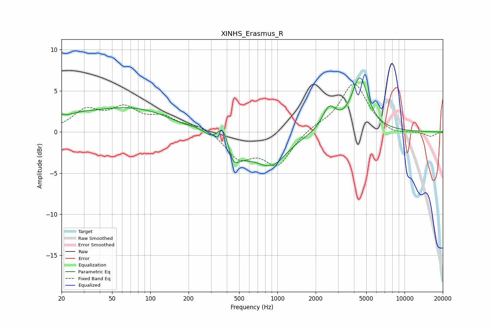

# XINHS_Erasmus_R
See [usage instructions](https://github.com/jaakkopasanen/AutoEq#usage) for more options and info.

### Parametric EQs
Apply preamp of -6.7 dB when using parametric equalizer.

|   # | Type    |   Fc (Hz) |    Q |   Gain (dB) |
|-----|---------|-----------|------|-------------|
|   1 | Peaking |        20 | 5.94 |         0.4 |
|   2 | Peaking |        26 | 1.15 |         0.7 |
|   3 | Peaking |        76 | 0.36 |         3.1 |
|   4 | Peaking |       246 | 1.45 |         1.5 |
|   5 | Peaking |       374 | 2.81 |         3.5 |
|   6 | Peaking |       382 | 0.62 |        -3.9 |
|   7 | Peaking |       448 | 3.85 |        -1.8 |
|   8 | Peaking |       914 | 1.24 |        -2.9 |
|   9 | Peaking |      2549 | 2.62 |         2.8 |
|  10 | Peaking |      4453 | 2.21 |         6.5 |

### Fixed Band EQs
When using fixed band (also called graphic) equalizer, apply preamp of **-5.9 dB** (if available) and set gains manually with these parameters.

|   # | Type    |   Fc (Hz) |    Q |   Gain (dB) |
|-----|---------|-----------|------|-------------|
|   1 | Peaking |        31 | 1.41 |         2.4 |
|   2 | Peaking |        62 | 1.41 |         2.6 |
|   3 | Peaking |       125 | 1.41 |         1.5 |
|   4 | Peaking |       250 | 1.41 |         0.9 |
|   5 | Peaking |       500 | 1.41 |        -3   |
|   6 | Peaking |      1000 | 1.41 |        -3.9 |
|   7 | Peaking |      2000 | 1.41 |         0.6 |
|   8 | Peaking |      4000 | 1.41 |         6   |
|   9 | Peaking |      8000 | 1.41 |        -0.5 |
|  10 | Peaking |     16000 | 1.41 |        -0.6 |

### Graphs

