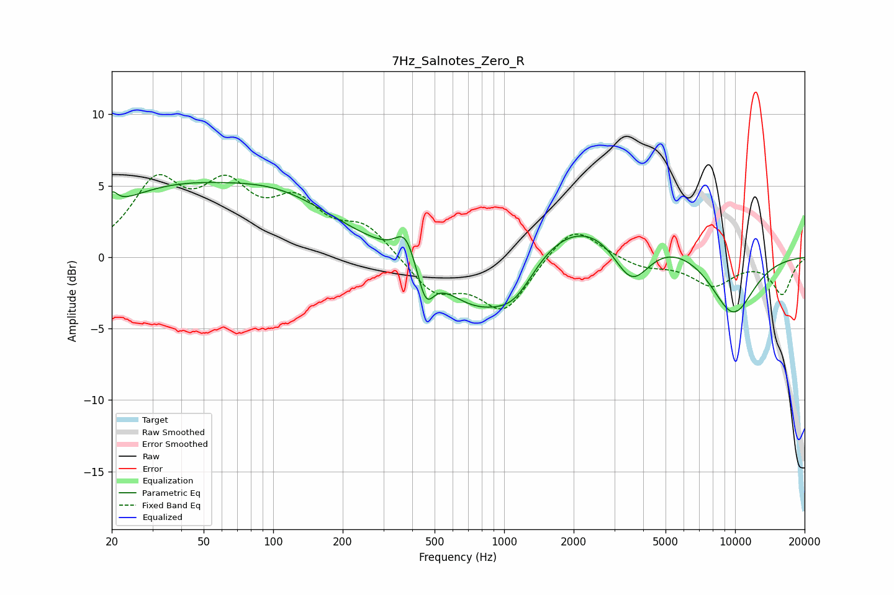

# 7Hz_Salnotes_Zero_R
See [usage instructions](https://github.com/jaakkopasanen/AutoEq#usage) for more options and info.

### Parametric EQs
Apply preamp of -5.3 dB when using parametric equalizer.

|   # | Type    |   Fc (Hz) |    Q |   Gain (dB) |
|-----|---------|-----------|------|-------------|
|   1 | Peaking |        20 | 5.99 |         1   |
|   2 | Peaking |        34 | 0.46 |         4   |
|   3 | Peaking |       109 | 0.55 |         3.3 |
|   4 | Peaking |       373 | 3.31 |         2   |
|   5 | Peaking |       458 | 4.13 |        -2.4 |
|   6 | Peaking |       761 | 0.85 |        -4.4 |
|   7 | Peaking |      1115 | 1.47 |        -2.6 |
|   8 | Peaking |      2200 | 0.38 |         3.8 |
|   9 | Peaking |      3561 | 1.67 |        -3.9 |
|  10 | Peaking |      9762 | 1.24 |        -4.5 |

### Fixed Band EQs
When using fixed band (also called graphic) equalizer, apply preamp of **-5.9 dB** (if available) and set gains manually with these parameters.

|   # | Type    |   Fc (Hz) |    Q |   Gain (dB) |
|-----|---------|-----------|------|-------------|
|   1 | Peaking |        31 | 1.41 |         4.8 |
|   2 | Peaking |        62 | 1.41 |         4.2 |
|   3 | Peaking |       125 | 1.41 |         3.3 |
|   4 | Peaking |       250 | 1.41 |         2   |
|   5 | Peaking |       500 | 1.41 |        -2.4 |
|   6 | Peaking |      1000 | 1.41 |        -3.7 |
|   7 | Peaking |      2000 | 1.41 |         2.5 |
|   8 | Peaking |      4000 | 1.41 |        -0.7 |
|   9 | Peaking |      8000 | 1.41 |        -1.9 |
|  10 | Peaking |     16000 | 1.41 |        -2.5 |

### Graphs

