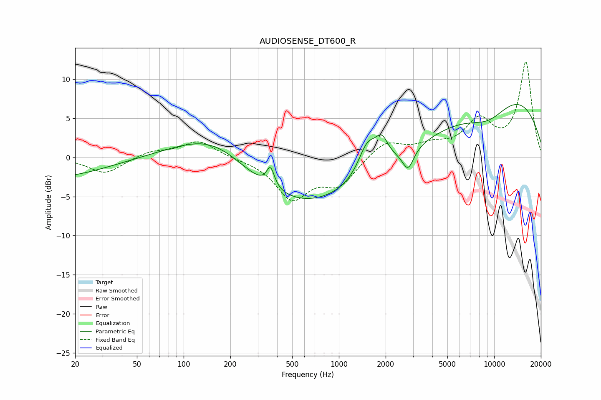

# AUDIOSENSE_DT600_R
See [usage instructions](https://github.com/jaakkopasanen/AutoEq#usage) for more options and info.

### Parametric EQs
Apply preamp of -6.9 dB when using parametric equalizer.

|   # | Type    |   Fc (Hz) |    Q |   Gain (dB) |
|-----|---------|-----------|------|-------------|
|   1 | Peaking |        50 | 0.18 |        -6.6 |
|   2 | Peaking |        54 | 0.33 |         5.1 |
|   3 | Peaking |       162 | 0.54 |         6.2 |
|   4 | Peaking |       363 | 5.66 |         2.5 |
|   5 | Peaking |      1407 | 0.18 |        -9.6 |
|   6 | Peaking |      1523 | 2.42 |         3.8 |
|   7 | Peaking |      1888 | 3.38 |         2.9 |
|   8 | Peaking |      2790 | 3.9  |        -2.7 |
|   9 | Peaking |      6679 | 0.18 |        11.6 |
|  10 | Peaking |      9158 | 0.88 |        -3.1 |

### Fixed Band EQs
When using fixed band (also called graphic) equalizer, apply preamp of **-12.3 dB** (if available) and set gains manually with these parameters.

|   # | Type    |   Fc (Hz) |    Q |   Gain (dB) |
|-----|---------|-----------|------|-------------|
|   1 | Peaking |        31 | 1.41 |        -2.1 |
|   2 | Peaking |        62 | 1.41 |         0.8 |
|   3 | Peaking |       125 | 1.41 |         2.1 |
|   4 | Peaking |       250 | 1.41 |        -0.1 |
|   5 | Peaking |       500 | 1.41 |        -5.1 |
|   6 | Peaking |      1000 | 1.41 |        -3.3 |
|   7 | Peaking |      2000 | 1.41 |         2.1 |
|   8 | Peaking |      4000 | 1.41 |         1.2 |
|   9 | Peaking |      8000 | 1.41 |         4.3 |
|  10 | Peaking |     16000 | 1.41 |        12.1 |

### Graphs

