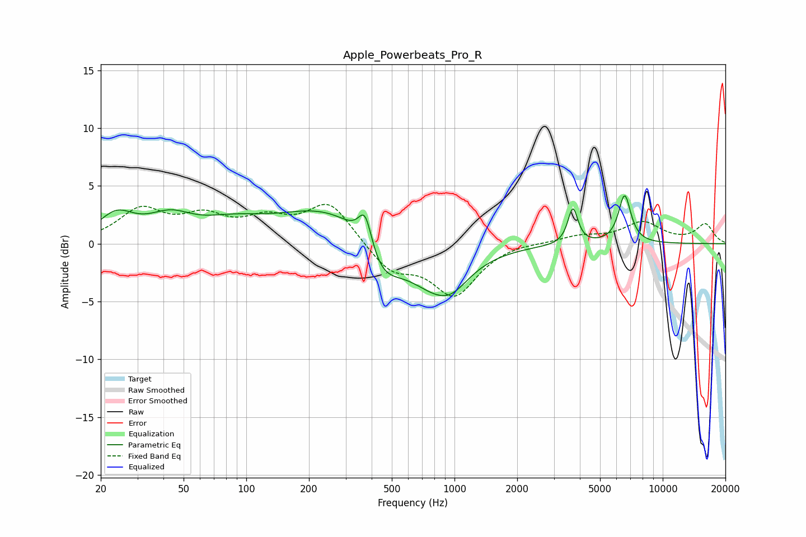

# Apple_Powerbeats_Pro_R
See [usage instructions](https://github.com/jaakkopasanen/AutoEq#usage) for more options and info.

### Parametric EQs
Apply preamp of -4.2 dB when using parametric equalizer.

|   # | Type    |   Fc (Hz) |    Q |   Gain (dB) |
|-----|---------|-----------|------|-------------|
|   1 | Peaking |        24 | 1.69 |         2.2 |
|   2 | Peaking |        43 | 1.32 |         1.9 |
|   3 | Peaking |        84 | 0.99 |         1.1 |
|   4 | Peaking |       308 | 0.47 |         4.1 |
|   5 | Peaking |       372 | 4.29 |         3.2 |
|   6 | Peaking |       441 | 1.41 |        -4.3 |
|   7 | Peaking |       789 | 0.9  |        -4.3 |
|   8 | Peaking |       966 | 1.74 |        -1.4 |
|   9 | Peaking |      3704 | 6    |         3.1 |
|  10 | Peaking |      6564 | 4.65 |         4.2 |

### Fixed Band EQs
When using fixed band (also called graphic) equalizer, apply preamp of **-3.5 dB** (if available) and set gains manually with these parameters.

|   # | Type    |   Fc (Hz) |    Q |   Gain (dB) |
|-----|---------|-----------|------|-------------|
|   1 | Peaking |        31 | 1.41 |         2.8 |
|   2 | Peaking |        62 | 1.41 |         2   |
|   3 | Peaking |       125 | 1.41 |         1.8 |
|   4 | Peaking |       250 | 1.41 |         3.5 |
|   5 | Peaking |       500 | 1.41 |        -2.3 |
|   6 | Peaking |      1000 | 1.41 |        -4.3 |
|   7 | Peaking |      2000 | 1.41 |         0.2 |
|   8 | Peaking |      4000 | 1.41 |         0.6 |
|   9 | Peaking |      8000 | 1.41 |         1.8 |
|  10 | Peaking |     16000 | 1.41 |         1.6 |

### Graphs

