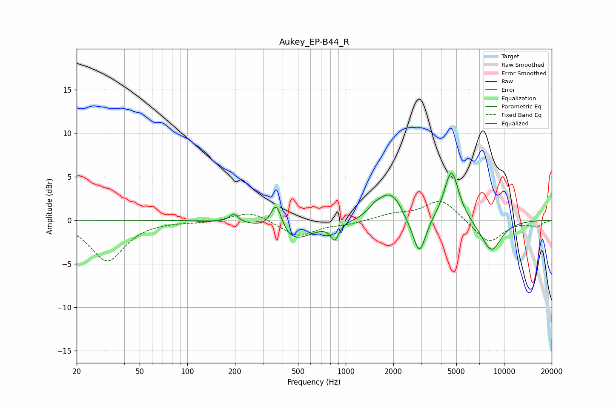

# Aukey_EP-B44_R
See [usage instructions](https://github.com/jaakkopasanen/AutoEq#usage) for more options and info.

### Parametric EQs
Apply preamp of -5.5 dB when using parametric equalizer.

|   # | Type    |   Fc (Hz) |    Q |   Gain (dB) |
|-----|---------|-----------|------|-------------|
|   1 | Peaking |       197 | 5.06 |         0.9 |
|   2 | Peaking |       364 | 4.07 |         3.4 |
|   3 | Peaking |       461 | 1.18 |        -2.5 |
|   4 | Peaking |       852 | 5.65 |        -1.8 |
|   5 | Peaking |      1516 | 3.67 |         0.7 |
|   6 | Peaking |      1855 | 2.12 |         2.9 |
|   7 | Peaking |      2113 | 4.6  |         0.5 |
|   8 | Peaking |      2918 | 3.49 |        -4.4 |
|   9 | Peaking |      4659 | 2.99 |         6   |
|  10 | Peaking |      8312 | 1.97 |        -3.6 |

### Fixed Band EQs
When using fixed band (also called graphic) equalizer, apply preamp of **-2.3 dB** (if available) and set gains manually with these parameters.

|   # | Type    |   Fc (Hz) |    Q |   Gain (dB) |
|-----|---------|-----------|------|-------------|
|   1 | Peaking |        31 | 1.41 |        -4.7 |
|   2 | Peaking |        62 | 1.41 |        -0   |
|   3 | Peaking |       125 | 1.41 |        -0.2 |
|   4 | Peaking |       250 | 1.41 |         1.1 |
|   5 | Peaking |       500 | 1.41 |        -1.9 |
|   6 | Peaking |      1000 | 1.41 |        -0.4 |
|   7 | Peaking |      2000 | 1.41 |         0.6 |
|   8 | Peaking |      4000 | 1.41 |         2.5 |
|   9 | Peaking |      8000 | 1.41 |        -2.7 |
|  10 | Peaking |     16000 | 1.41 |        -0.7 |

### Graphs

