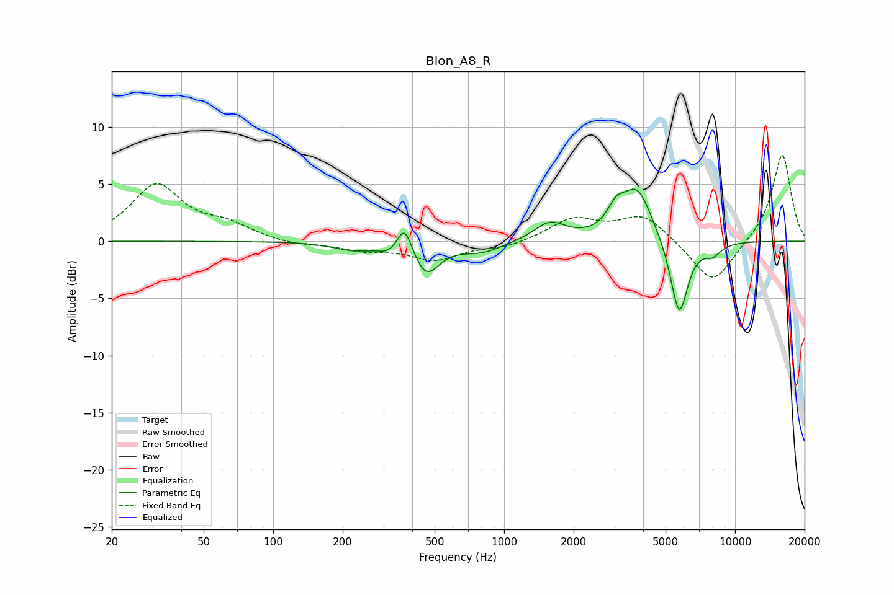

# Blon_A8_R
See [usage instructions](https://github.com/jaakkopasanen/AutoEq#usage) for more options and info.

### Parametric EQs
Apply preamp of -4.6 dB when using parametric equalizer.

|   # | Type    |   Fc (Hz) |    Q |   Gain (dB) |
|-----|---------|-----------|------|-------------|
|   1 | Peaking |       219 | 1.7  |        -0.6 |
|   2 | Peaking |       318 | 2.97 |        -0.7 |
|   3 | Peaking |       370 | 4.44 |         2.6 |
|   4 | Peaking |       460 | 2.54 |        -2.8 |
|   5 | Peaking |       803 | 1.55 |        -0.9 |
|   6 | Peaking |      1579 | 2.11 |         1.6 |
|   7 | Peaking |      3047 | 3.81 |         1.6 |
|   8 | Peaking |      3761 | 2.14 |         4.6 |
|   9 | Peaking |      5728 | 3.61 |        -6.8 |
|  10 | Peaking |      7989 | 3.55 |        -1   |

### Fixed Band EQs
When using fixed band (also called graphic) equalizer, apply preamp of **-7.6 dB** (if available) and set gains manually with these parameters.

|   # | Type    |   Fc (Hz) |    Q |   Gain (dB) |
|-----|---------|-----------|------|-------------|
|   1 | Peaking |        31 | 1.41 |         4.8 |
|   2 | Peaking |        62 | 1.41 |         1.2 |
|   3 | Peaking |       125 | 1.41 |        -0.4 |
|   4 | Peaking |       250 | 1.41 |        -0.7 |
|   5 | Peaking |       500 | 1.41 |        -1.5 |
|   6 | Peaking |      1000 | 1.41 |        -0.5 |
|   7 | Peaking |      2000 | 1.41 |         1.9 |
|   8 | Peaking |      4000 | 1.41 |         2.3 |
|   9 | Peaking |      8000 | 1.41 |        -3.9 |
|  10 | Peaking |     16000 | 1.41 |         7.7 |

### Graphs

