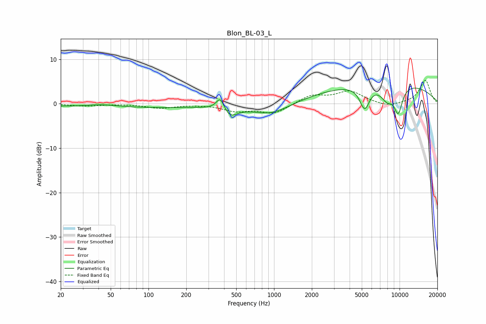

# Blon_BL-03_L
See [usage instructions](https://github.com/jaakkopasanen/AutoEq#usage) for more options and info.

### Parametric EQs
Apply preamp of -3.6 dB when using parametric equalizer.

|   # | Type    |   Fc (Hz) |    Q |   Gain (dB) |
|-----|---------|-----------|------|-------------|
|   1 | Peaking |        42 | 1.1  |         0.6 |
|   2 | Peaking |        71 | 0.19 |        -0.9 |
|   3 | Peaking |       374 | 4.38 |         3   |
|   4 | Peaking |       443 | 2.51 |        -2.3 |
|   5 | Peaking |       948 | 0.93 |        -2.6 |
|   6 | Peaking |      5251 | 3.53 |        -5   |
|   7 | Peaking |      5520 | 5.69 |        -0.3 |
|   8 | Peaking |      7616 | 0.25 |         5.1 |
|   9 | Peaking |      7943 | 2.57 |        -3.2 |
|  10 | Peaking |      9756 | 3.56 |        -5.9 |

### Fixed Band EQs
When using fixed band (also called graphic) equalizer, apply preamp of **-5.4 dB** (if available) and set gains manually with these parameters.

|   # | Type    |   Fc (Hz) |    Q |   Gain (dB) |
|-----|---------|-----------|------|-------------|
|   1 | Peaking |        31 | 1.41 |        -0.5 |
|   2 | Peaking |        62 | 1.41 |        -0   |
|   3 | Peaking |       125 | 1.41 |        -0.9 |
|   4 | Peaking |       250 | 1.41 |        -0.1 |
|   5 | Peaking |       500 | 1.41 |        -1.5 |
|   6 | Peaking |      1000 | 1.41 |        -2.2 |
|   7 | Peaking |      2000 | 1.41 |         1.9 |
|   8 | Peaking |      4000 | 1.41 |         2.7 |
|   9 | Peaking |      8000 | 1.41 |        -0.8 |
|  10 | Peaking |     16000 | 1.41 |         5.3 |

### Graphs

