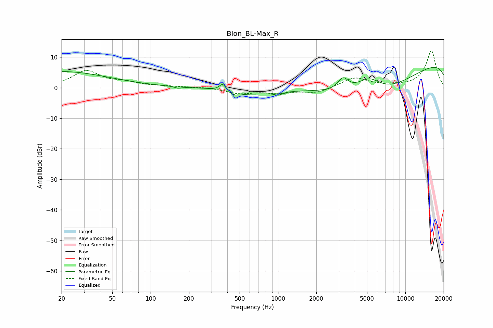

# Blon_BL-Max_R
See [usage instructions](https://github.com/jaakkopasanen/AutoEq#usage) for more options and info.

### Parametric EQs
Apply preamp of -6.7 dB when using parametric equalizer.

|   # | Type    |   Fc (Hz) |    Q |   Gain (dB) |
|-----|---------|-----------|------|-------------|
|   1 | Peaking |        20 | 0.38 |         5.3 |
|   2 | Peaking |       165 | 5.47 |        -0.5 |
|   3 | Peaking |       369 | 5.21 |         2.8 |
|   4 | Peaking |       446 | 1.86 |        -2.2 |
|   5 | Peaking |       742 | 1.23 |        -1.2 |
|   6 | Peaking |      1007 | 4.81 |        -1   |
|   7 | Peaking |      3242 | 3.54 |         3.9 |
|   8 | Peaking |      5223 | 1.33 |         6.2 |
|   9 | Peaking |      5897 | 0.35 |       -15.7 |
|  10 | Peaking |     10000 | 0.18 |        13.5 |

### Fixed Band EQs
When using fixed band (also called graphic) equalizer, apply preamp of **-12.2 dB** (if available) and set gains manually with these parameters.

|   # | Type    |   Fc (Hz) |    Q |   Gain (dB) |
|-----|---------|-----------|------|-------------|
|   1 | Peaking |        31 | 1.41 |         5.3 |
|   2 | Peaking |        62 | 1.41 |         1.4 |
|   3 | Peaking |       125 | 1.41 |         0.3 |
|   4 | Peaking |       250 | 1.41 |         0.2 |
|   5 | Peaking |       500 | 1.41 |        -1.8 |
|   6 | Peaking |      1000 | 1.41 |        -1.5 |
|   7 | Peaking |      2000 | 1.41 |        -1.7 |
|   8 | Peaking |      4000 | 1.41 |         3.3 |
|   9 | Peaking |      8000 | 1.41 |         0.4 |
|  10 | Peaking |     16000 | 1.41 |        12.1 |

### Graphs

