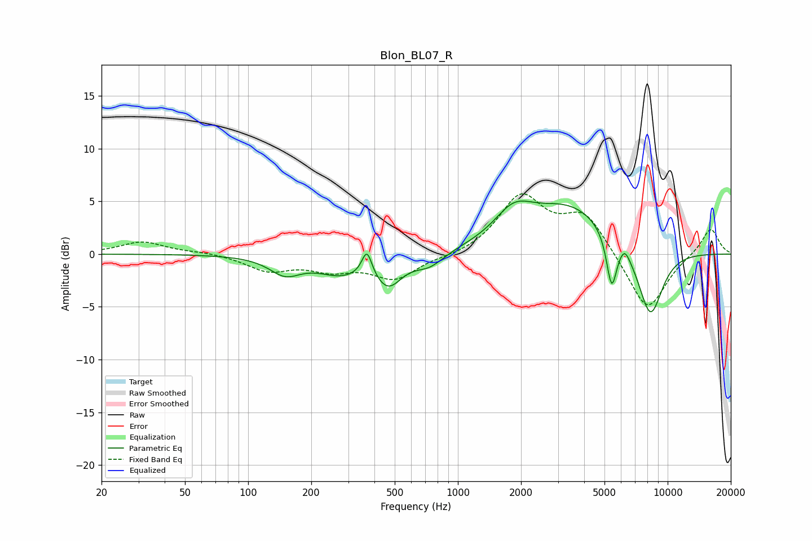

# Blon_BL07_R
See [usage instructions](https://github.com/jaakkopasanen/AutoEq#usage) for more options and info.

### Parametric EQs
Apply preamp of -5.1 dB when using parametric equalizer.

|   # | Type    |   Fc (Hz) |    Q |   Gain (dB) |
|-----|---------|-----------|------|-------------|
|   1 | Peaking |       150 | 1.91 |        -1.6 |
|   2 | Peaking |       275 | 1.26 |        -1.6 |
|   3 | Peaking |       368 | 5.99 |         2.4 |
|   4 | Peaking |       466 | 2.2  |        -2.7 |
|   5 | Peaking |       731 | 2.02 |        -1.2 |
|   6 | Peaking |      1842 | 1.55 |         2.6 |
|   7 | Peaking |      3415 | 0.68 |         4.5 |
|   8 | Peaking |      5408 | 5.64 |        -4.9 |
|   9 | Peaking |      6246 | 5.8  |         0.9 |
|  10 | Peaking |      8265 | 2.16 |        -6.7 |

### Fixed Band EQs
When using fixed band (also called graphic) equalizer, apply preamp of **-5.8 dB** (if available) and set gains manually with these parameters.

|   # | Type    |   Fc (Hz) |    Q |   Gain (dB) |
|-----|---------|-----------|------|-------------|
|   1 | Peaking |        31 | 1.41 |         1.2 |
|   2 | Peaking |        62 | 1.41 |         0.2 |
|   3 | Peaking |       125 | 1.41 |        -1.5 |
|   4 | Peaking |       250 | 1.41 |        -1.3 |
|   5 | Peaking |       500 | 1.41 |        -2.3 |
|   6 | Peaking |      1000 | 1.41 |        -0.3 |
|   7 | Peaking |      2000 | 1.41 |         5.3 |
|   8 | Peaking |      4000 | 1.41 |         3.7 |
|   9 | Peaking |      8000 | 1.41 |        -5.6 |
|  10 | Peaking |     16000 | 1.41 |         2.6 |

### Graphs

