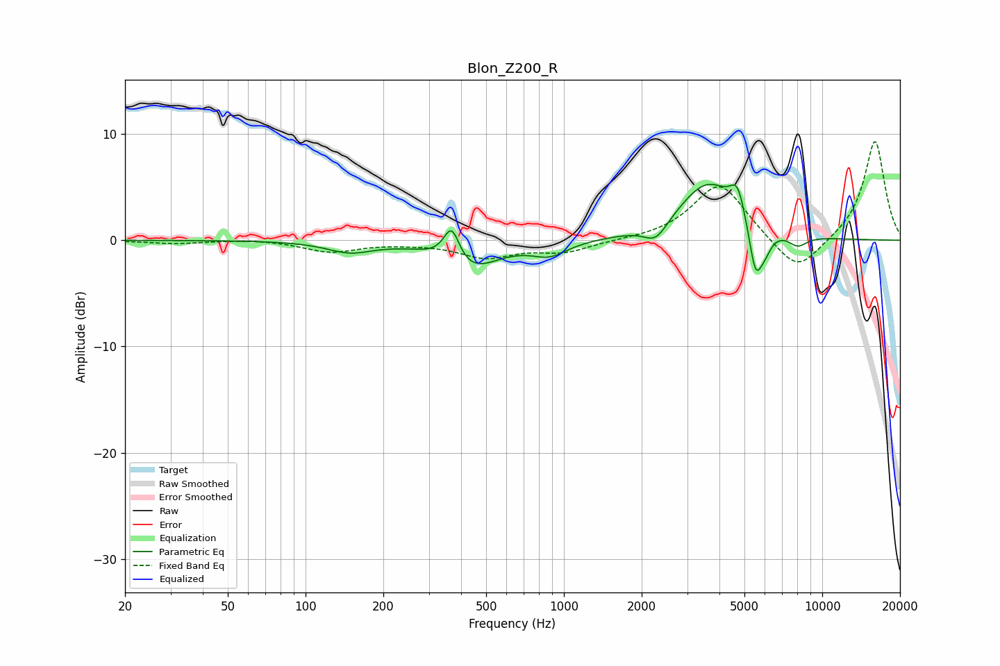

# Blon_Z200_R
See [usage instructions](https://github.com/jaakkopasanen/AutoEq#usage) for more options and info.

### Parametric EQs
Apply preamp of -5.4 dB when using parametric equalizer.

|   # | Type    |   Fc (Hz) |    Q |   Gain (dB) |
|-----|---------|-----------|------|-------------|
|   1 | Peaking |       149 | 1.61 |        -1   |
|   2 | Peaking |       367 | 4.55 |         3.3 |
|   3 | Peaking |       432 | 1.36 |        -2.7 |
|   4 | Peaking |       881 | 2.06 |        -1.3 |
|   5 | Peaking |      2270 | 3.08 |        -1.7 |
|   6 | Peaking |      3605 | 1.23 |         5.4 |
|   7 | Peaking |      4700 | 5.02 |         2.6 |
|   8 | Peaking |      5517 | 5.47 |        -4.7 |
|   9 | Peaking |      6002 | 5.04 |        -1.6 |
|  10 | Peaking |      8034 | 3.65 |        -1.1 |

### Fixed Band EQs
When using fixed band (also called graphic) equalizer, apply preamp of **-9.4 dB** (if available) and set gains manually with these parameters.

|   # | Type    |   Fc (Hz) |    Q |   Gain (dB) |
|-----|---------|-----------|------|-------------|
|   1 | Peaking |        31 | 1.41 |        -0.3 |
|   2 | Peaking |        62 | 1.41 |         0.2 |
|   3 | Peaking |       125 | 1.41 |        -1.1 |
|   4 | Peaking |       250 | 1.41 |        -0.2 |
|   5 | Peaking |       500 | 1.41 |        -1.5 |
|   6 | Peaking |      1000 | 1.41 |        -1.1 |
|   7 | Peaking |      2000 | 1.41 |        -0   |
|   8 | Peaking |      4000 | 1.41 |         5.5 |
|   9 | Peaking |      8000 | 1.41 |        -3.4 |
|  10 | Peaking |     16000 | 1.41 |         9.5 |

### Graphs

