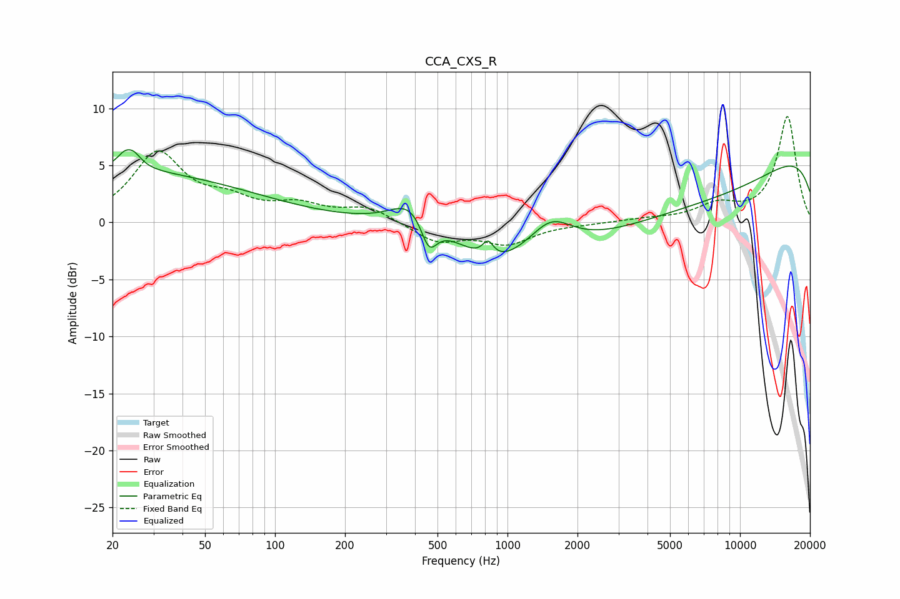

# CCA_CXS_R
See [usage instructions](https://github.com/jaakkopasanen/AutoEq#usage) for more options and info.

### Parametric EQs
Apply preamp of -6.5 dB when using parametric equalizer.

|   # | Type    |   Fc (Hz) |    Q |   Gain (dB) |
|-----|---------|-----------|------|-------------|
|   1 | Peaking |        20 | 0.23 |         4.5 |
|   2 | Peaking |        24 | 5.99 |        -1.3 |
|   3 | Peaking |        24 | 4.1  |         3.2 |
|   4 | Peaking |       388 | 1.61 |         2.5 |
|   5 | Peaking |       459 | 3.93 |        -2.8 |
|   6 | Peaking |       825 | 5.98 |         1.4 |
|   7 | Peaking |       865 | 1.06 |        -2.3 |
|   8 | Peaking |      1538 | 1.53 |         2.6 |
|   9 | Peaking |      4719 | 0.22 |        -6.9 |
|  10 | Peaking |     10000 | 0.18 |         8.7 |

### Fixed Band EQs
When using fixed band (also called graphic) equalizer, apply preamp of **-9.4 dB** (if available) and set gains manually with these parameters.

|   # | Type    |   Fc (Hz) |    Q |   Gain (dB) |
|-----|---------|-----------|------|-------------|
|   1 | Peaking |        31 | 1.41 |         5.9 |
|   2 | Peaking |        62 | 1.41 |         1.5 |
|   3 | Peaking |       125 | 1.41 |         1.3 |
|   4 | Peaking |       250 | 1.41 |         1.3 |
|   5 | Peaking |       500 | 1.41 |        -1.7 |
|   6 | Peaking |      1000 | 1.41 |        -1.7 |
|   7 | Peaking |      2000 | 1.41 |        -0.1 |
|   8 | Peaking |      4000 | 1.41 |         0.2 |
|   9 | Peaking |      8000 | 1.41 |         1.4 |
|  10 | Peaking |     16000 | 1.41 |         9.3 |

### Graphs

