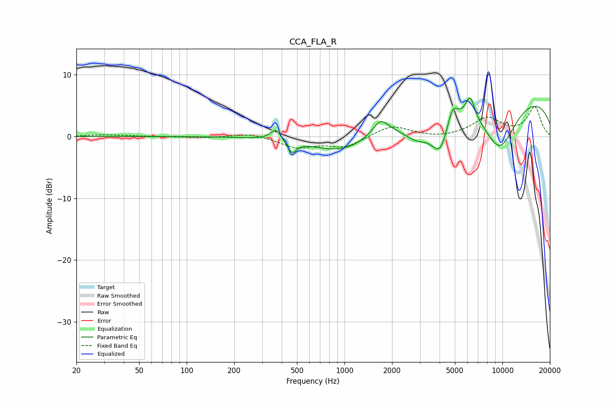

# CCA_FLA_R
See [usage instructions](https://github.com/jaakkopasanen/AutoEq#usage) for more options and info.

### Parametric EQs
Apply preamp of -6.3 dB when using parametric equalizer.

|   # | Type    |   Fc (Hz) |    Q |   Gain (dB) |
|-----|---------|-----------|------|-------------|
|   1 | Peaking |       368 | 4.4  |         1.9 |
|   2 | Peaking |       464 | 4.94 |        -2   |
|   3 | Peaking |       987 | 0.74 |        -3.4 |
|   4 | Peaking |      1689 | 3.07 |         2.3 |
|   5 | Peaking |      2893 | 1.42 |        -4   |
|   6 | Peaking |      4032 | 2.49 |        -5.8 |
|   7 | Peaking |      4830 | 4.41 |         3   |
|   8 | Peaking |      6250 | 4.85 |         3.5 |
|   9 | Peaking |      8995 | 0.18 |         7.9 |
|  10 | Peaking |      9587 | 1.06 |        -9.1 |

### Fixed Band EQs
When using fixed band (also called graphic) equalizer, apply preamp of **-4.9 dB** (if available) and set gains manually with these parameters.

|   # | Type    |   Fc (Hz) |    Q |   Gain (dB) |
|-----|---------|-----------|------|-------------|
|   1 | Peaking |        31 | 1.41 |         0.3 |
|   2 | Peaking |        62 | 1.41 |         0   |
|   3 | Peaking |       125 | 1.41 |        -0.2 |
|   4 | Peaking |       250 | 1.41 |         0.6 |
|   5 | Peaking |       500 | 1.41 |        -1.7 |
|   6 | Peaking |      1000 | 1.41 |        -1.7 |
|   7 | Peaking |      2000 | 1.41 |         1.8 |
|   8 | Peaking |      4000 | 1.41 |        -0.3 |
|   9 | Peaking |      8000 | 1.41 |         2.9 |
|  10 | Peaking |     16000 | 1.41 |         4.7 |

### Graphs

