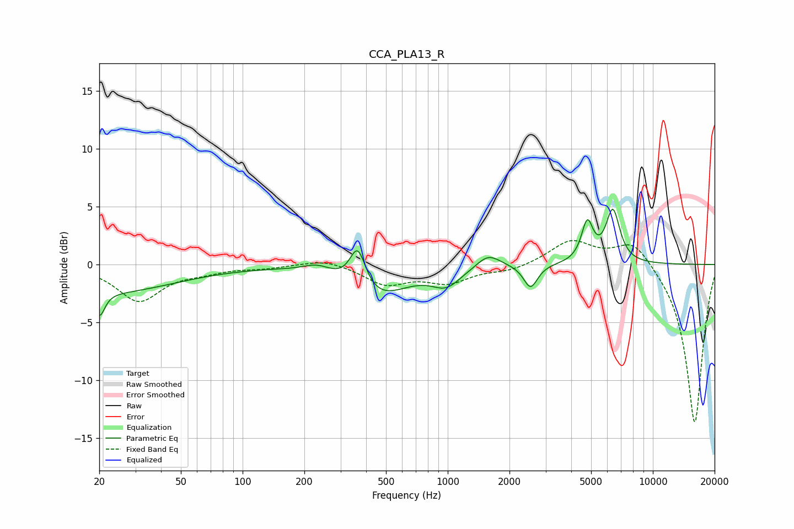

# CCA_PLA13_R
See [usage instructions](https://github.com/jaakkopasanen/AutoEq#usage) for more options and info.

### Parametric EQs
Apply preamp of -4.9 dB when using parametric equalizer.

|   # | Type    |   Fc (Hz) |    Q |   Gain (dB) |
|-----|---------|-----------|------|-------------|
|   1 | Peaking |        20 | 5.85 |        -2.1 |
|   2 | Peaking |        22 | 0.43 |        -2.4 |
|   3 | Peaking |       231 | 1.99 |         0.7 |
|   4 | Peaking |       364 | 3.63 |         3.5 |
|   5 | Peaking |       448 | 0.98 |        -2.8 |
|   6 | Peaking |       985 | 2.02 |        -1.5 |
|   7 | Peaking |      1576 | 2.44 |         1.2 |
|   8 | Peaking |      2534 | 4.2  |        -2   |
|   9 | Peaking |      4791 | 4.97 |         3.4 |
|  10 | Peaking |      6382 | 4.05 |         4.5 |

### Fixed Band EQs
When using fixed band (also called graphic) equalizer, apply preamp of **-2.2 dB** (if available) and set gains manually with these parameters.

|   # | Type    |   Fc (Hz) |    Q |   Gain (dB) |
|-----|---------|-----------|------|-------------|
|   1 | Peaking |        31 | 1.41 |        -3.1 |
|   2 | Peaking |        62 | 1.41 |        -0.5 |
|   3 | Peaking |       125 | 1.41 |        -0.3 |
|   4 | Peaking |       250 | 1.41 |         0.5 |
|   5 | Peaking |       500 | 1.41 |        -1.6 |
|   6 | Peaking |      1000 | 1.41 |        -1.4 |
|   7 | Peaking |      2000 | 1.41 |        -0.5 |
|   8 | Peaking |      4000 | 1.41 |         2.1 |
|   9 | Peaking |      8000 | 1.41 |         2.3 |
|  10 | Peaking |     16000 | 1.41 |       -13.8 |

### Graphs

