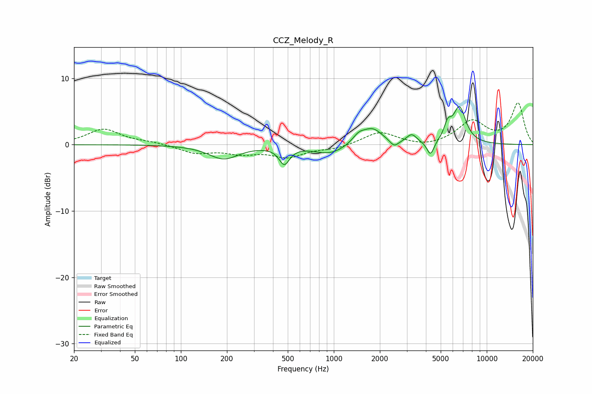

# CCZ_Melody_R
See [usage instructions](https://github.com/jaakkopasanen/AutoEq#usage) for more options and info.

### Parametric EQs
Apply preamp of -5.8 dB when using parametric equalizer.

|   # | Type    |   Fc (Hz) |    Q |   Gain (dB) |
|-----|---------|-----------|------|-------------|
|   1 | Peaking |       190 | 1.46 |        -2.1 |
|   2 | Peaking |       474 | 4.16 |        -2.6 |
|   3 | Peaking |       944 | 1.36 |        -1.4 |
|   4 | Peaking |      1452 | 3.44 |         1.2 |
|   5 | Peaking |      1790 | 2.13 |         2.4 |
|   6 | Peaking |      2481 | 5.07 |        -1   |
|   7 | Peaking |      3230 | 4.31 |         1.3 |
|   8 | Peaking |      4286 | 6    |        -2.2 |
|   9 | Peaking |      5559 | 5.95 |         2.1 |
|  10 | Peaking |      6627 | 3.26 |         5.4 |

### Fixed Band EQs
When using fixed band (also called graphic) equalizer, apply preamp of **-6.4 dB** (if available) and set gains manually with these parameters.

|   # | Type    |   Fc (Hz) |    Q |   Gain (dB) |
|-----|---------|-----------|------|-------------|
|   1 | Peaking |        31 | 1.41 |         2.3 |
|   2 | Peaking |        62 | 1.41 |         0.3 |
|   3 | Peaking |       125 | 1.41 |        -1.2 |
|   4 | Peaking |       250 | 1.41 |        -1.1 |
|   5 | Peaking |       500 | 1.41 |        -1.7 |
|   6 | Peaking |      1000 | 1.41 |        -0.6 |
|   7 | Peaking |      2000 | 1.41 |         1.9 |
|   8 | Peaking |      4000 | 1.41 |        -0.5 |
|   9 | Peaking |      8000 | 1.41 |         3.4 |
|  10 | Peaking |     16000 | 1.41 |         6.2 |

### Graphs

