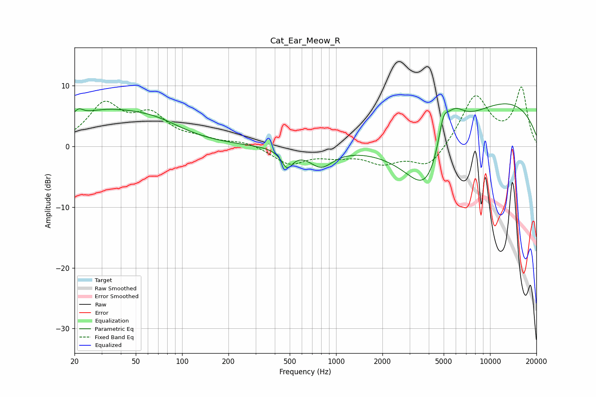

# Cat_Ear_Meow_R
See [usage instructions](https://github.com/jaakkopasanen/AutoEq#usage) for more options and info.

### Parametric EQs
Apply preamp of -7.1 dB when using parametric equalizer.

|   # | Type    |   Fc (Hz) |    Q |   Gain (dB) |
|-----|---------|-----------|------|-------------|
|   1 | Peaking |        21 | 4.93 |         1.1 |
|   2 | Peaking |        31 | 0.47 |         5.5 |
|   3 | Peaking |        69 | 0.85 |         1.6 |
|   4 | Peaking |       479 | 3.77 |         1.8 |
|   5 | Peaking |       480 | 3.79 |        -4.7 |
|   6 | Peaking |       799 | 1.82 |        -3.1 |
|   7 | Peaking |      3895 | 0.82 |       -13.3 |
|   8 | Peaking |      4967 | 4.16 |         4.6 |
|   9 | Peaking |      5792 | 1.88 |         5.3 |
|  10 | Peaking |      9480 | 0.24 |         8.6 |

### Fixed Band EQs
When using fixed band (also called graphic) equalizer, apply preamp of **-9.9 dB** (if available) and set gains manually with these parameters.

|   # | Type    |   Fc (Hz) |    Q |   Gain (dB) |
|-----|---------|-----------|------|-------------|
|   1 | Peaking |        31 | 1.41 |         6.5 |
|   2 | Peaking |        62 | 1.41 |         4.6 |
|   3 | Peaking |       125 | 1.41 |         0.9 |
|   4 | Peaking |       250 | 1.41 |         0.8 |
|   5 | Peaking |       500 | 1.41 |        -2.8 |
|   6 | Peaking |      1000 | 1.41 |        -1.2 |
|   7 | Peaking |      2000 | 1.41 |        -2.5 |
|   8 | Peaking |      4000 | 1.41 |        -3.6 |
|   9 | Peaking |      8000 | 1.41 |         8.4 |
|  10 | Peaking |     16000 | 1.41 |         9.4 |

### Graphs

