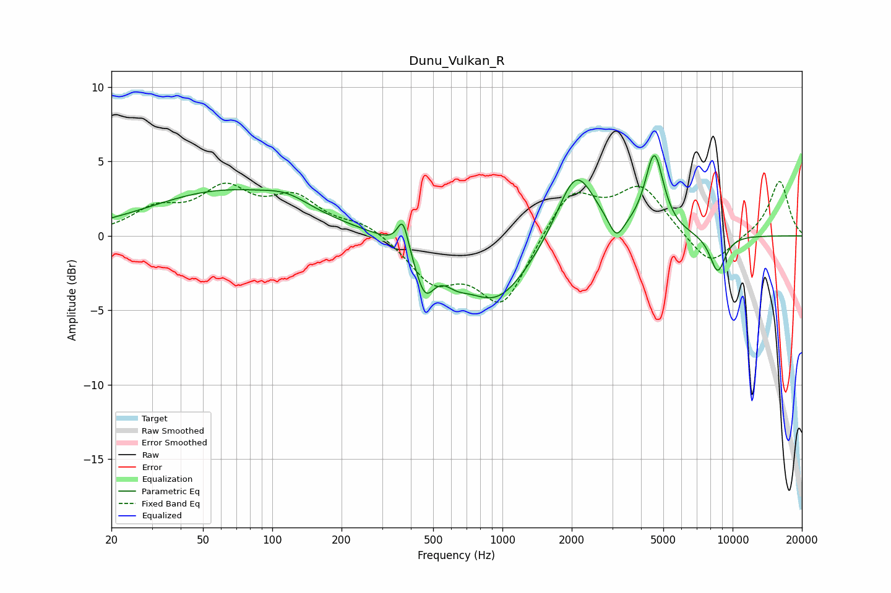

# Dunu_Vulkan_R
See [usage instructions](https://github.com/jaakkopasanen/AutoEq#usage) for more options and info.

### Parametric EQs
Apply preamp of -5.5 dB when using parametric equalizer.

|   # | Type    |   Fc (Hz) |    Q |   Gain (dB) |
|-----|---------|-----------|------|-------------|
|   1 | Peaking |        62 | 0.44 |         2.9 |
|   2 | Peaking |       116 | 1.44 |         0.7 |
|   3 | Peaking |       369 | 6    |         2.1 |
|   4 | Peaking |       460 | 3.42 |        -2.8 |
|   5 | Peaking |       628 | 2.61 |        -0.9 |
|   6 | Peaking |       938 | 0.94 |        -4.4 |
|   7 | Peaking |      2087 | 1.72 |         4.9 |
|   8 | Peaking |      3125 | 4.28 |        -1.5 |
|   9 | Peaking |      4571 | 3.53 |         5.3 |
|  10 | Peaking |      8611 | 3.74 |        -2.5 |

### Fixed Band EQs
When using fixed band (also called graphic) equalizer, apply preamp of **-3.8 dB** (if available) and set gains manually with these parameters.

|   # | Type    |   Fc (Hz) |    Q |   Gain (dB) |
|-----|---------|-----------|------|-------------|
|   1 | Peaking |        31 | 1.41 |         1.6 |
|   2 | Peaking |        62 | 1.41 |         2.8 |
|   3 | Peaking |       125 | 1.41 |         2.3 |
|   4 | Peaking |       250 | 1.41 |         0.8 |
|   5 | Peaking |       500 | 1.41 |        -2.9 |
|   6 | Peaking |      1000 | 1.41 |        -4.6 |
|   7 | Peaking |      2000 | 1.41 |         3.2 |
|   8 | Peaking |      4000 | 1.41 |         3.2 |
|   9 | Peaking |      8000 | 1.41 |        -2.2 |
|  10 | Peaking |     16000 | 1.41 |         3.7 |

### Graphs

