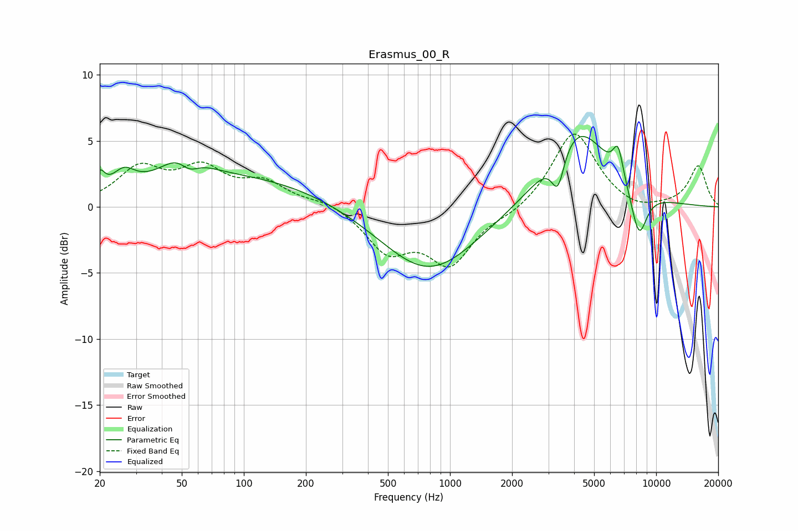

# Erasmus_00_R
See [usage instructions](https://github.com/jaakkopasanen/AutoEq#usage) for more options and info.

### Parametric EQs
Apply preamp of -5.4 dB when using parametric equalizer.

|   # | Type    |   Fc (Hz) |    Q |   Gain (dB) |
|-----|---------|-----------|------|-------------|
|   1 | Peaking |        20 | 5.99 |         1.4 |
|   2 | Peaking |        26 | 2.66 |         1.4 |
|   3 | Peaking |        51 | 1.57 |         2.6 |
|   4 | Peaking |        54 | 2.74 |        -1.7 |
|   5 | Peaking |        93 | 0.31 |         2.3 |
|   6 | Peaking |       790 | 0.61 |        -5.1 |
|   7 | Peaking |      3339 | 4.49 |        -2.9 |
|   8 | Peaking |      4133 | 0.92 |         6.2 |
|   9 | Peaking |      6540 | 5.51 |         2.3 |
|  10 | Peaking |      8250 | 3.33 |        -3.6 |

### Fixed Band EQs
When using fixed band (also called graphic) equalizer, apply preamp of **-5.6 dB** (if available) and set gains manually with these parameters.

|   # | Type    |   Fc (Hz) |    Q |   Gain (dB) |
|-----|---------|-----------|------|-------------|
|   1 | Peaking |        31 | 1.41 |         2.7 |
|   2 | Peaking |        62 | 1.41 |         2.6 |
|   3 | Peaking |       125 | 1.41 |         1.7 |
|   4 | Peaking |       250 | 1.41 |         0.5 |
|   5 | Peaking |       500 | 1.41 |        -3.2 |
|   6 | Peaking |      1000 | 1.41 |        -4.1 |
|   7 | Peaking |      2000 | 1.41 |        -0.5 |
|   8 | Peaking |      4000 | 1.41 |         5.8 |
|   9 | Peaking |      8000 | 1.41 |        -0.5 |
|  10 | Peaking |     16000 | 1.41 |         3.1 |

### Graphs

