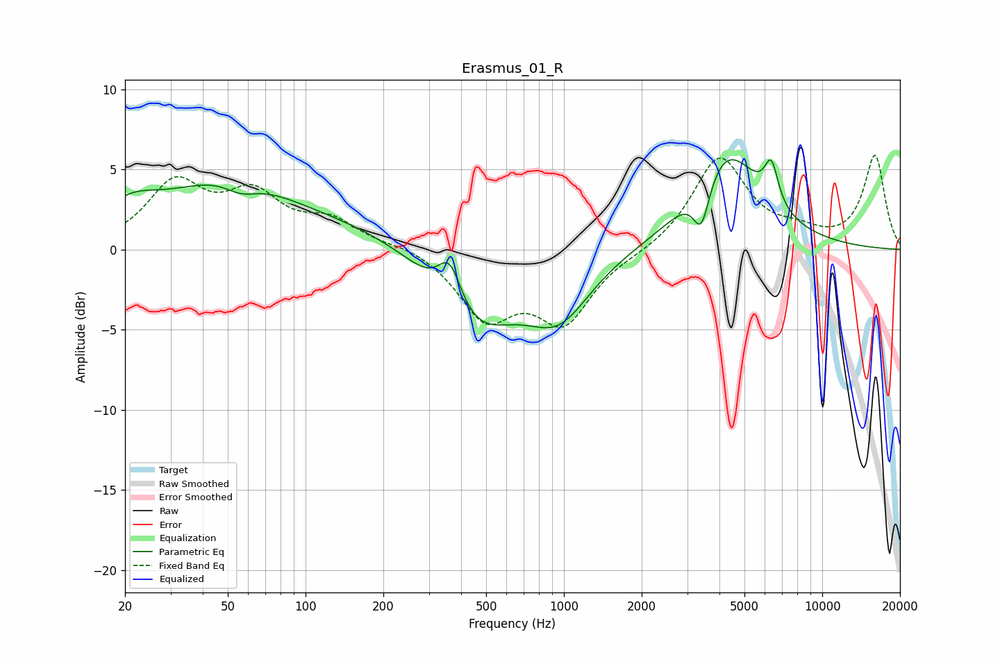

# Erasmus_01_R
See [usage instructions](https://github.com/jaakkopasanen/AutoEq#usage) for more options and info.

### Parametric EQs
Apply preamp of -5.7 dB when using parametric equalizer.

|   # | Type    |   Fc (Hz) |    Q |   Gain (dB) |
|-----|---------|-----------|------|-------------|
|   1 | Peaking |        21 | 1.28 |         1.7 |
|   2 | Peaking |        50 | 0.56 |         3.9 |
|   3 | Peaking |        56 | 2.22 |        -0.8 |
|   4 | Peaking |       298 | 0.36 |         2   |
|   5 | Peaking |       362 | 3.02 |         3   |
|   6 | Peaking |       439 | 0.79 |        -6.3 |
|   7 | Peaking |       955 | 1.12 |        -3.8 |
|   8 | Peaking |      3409 | 4.39 |        -3   |
|   9 | Peaking |      4231 | 1.04 |         6.1 |
|  10 | Peaking |      6354 | 5.19 |         2.5 |

### Fixed Band EQs
When using fixed band (also called graphic) equalizer, apply preamp of **-6.0 dB** (if available) and set gains manually with these parameters.

|   # | Type    |   Fc (Hz) |    Q |   Gain (dB) |
|-----|---------|-----------|------|-------------|
|   1 | Peaking |        31 | 1.41 |         3.9 |
|   2 | Peaking |        62 | 1.41 |         3.1 |
|   3 | Peaking |       125 | 1.41 |         1.6 |
|   4 | Peaking |       250 | 1.41 |         0.3 |
|   5 | Peaking |       500 | 1.41 |        -4   |
|   6 | Peaking |      1000 | 1.41 |        -4.3 |
|   7 | Peaking |      2000 | 1.41 |        -0.2 |
|   8 | Peaking |      4000 | 1.41 |         5.7 |
|   9 | Peaking |      8000 | 1.41 |         0.8 |
|  10 | Peaking |     16000 | 1.41 |         5.8 |

### Graphs

