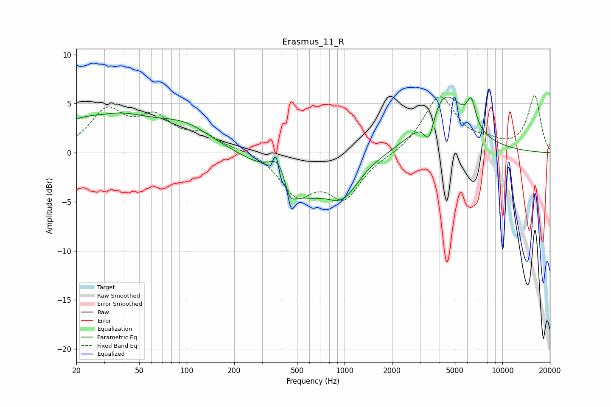

# Erasmus_11_R
See [usage instructions](https://github.com/jaakkopasanen/AutoEq#usage) for more options and info.

### Parametric EQs
Apply preamp of -5.8 dB when using parametric equalizer.

|   # | Type    |   Fc (Hz) |    Q |   Gain (dB) |
|-----|---------|-----------|------|-------------|
|   1 | Peaking |        20 | 1.13 |         1.7 |
|   2 | Peaking |        38 | 0.7  |         2.9 |
|   3 | Peaking |        96 | 0.77 |         2.4 |
|   4 | Peaking |       389 | 2.11 |         3.7 |
|   5 | Peaking |       446 | 4.21 |        -2   |
|   6 | Peaking |       481 | 0.89 |        -5   |
|   7 | Peaking |       972 | 1.35 |        -3.4 |
|   8 | Peaking |      3432 | 4.32 |        -3   |
|   9 | Peaking |      4269 | 1.09 |         6.2 |
|  10 | Peaking |      6357 | 5.18 |         2.6 |

### Fixed Band EQs
When using fixed band (also called graphic) equalizer, apply preamp of **-5.9 dB** (if available) and set gains manually with these parameters.

|   # | Type    |   Fc (Hz) |    Q |   Gain (dB) |
|-----|---------|-----------|------|-------------|
|   1 | Peaking |        31 | 1.41 |         4   |
|   2 | Peaking |        62 | 1.41 |         3.1 |
|   3 | Peaking |       125 | 1.41 |         1.6 |
|   4 | Peaking |       250 | 1.41 |         0.3 |
|   5 | Peaking |       500 | 1.41 |        -4   |
|   6 | Peaking |      1000 | 1.41 |        -4.3 |
|   7 | Peaking |      2000 | 1.41 |        -0.2 |
|   8 | Peaking |      4000 | 1.41 |         5.7 |
|   9 | Peaking |      8000 | 1.41 |         0.8 |
|  10 | Peaking |     16000 | 1.41 |         5.8 |

### Graphs

