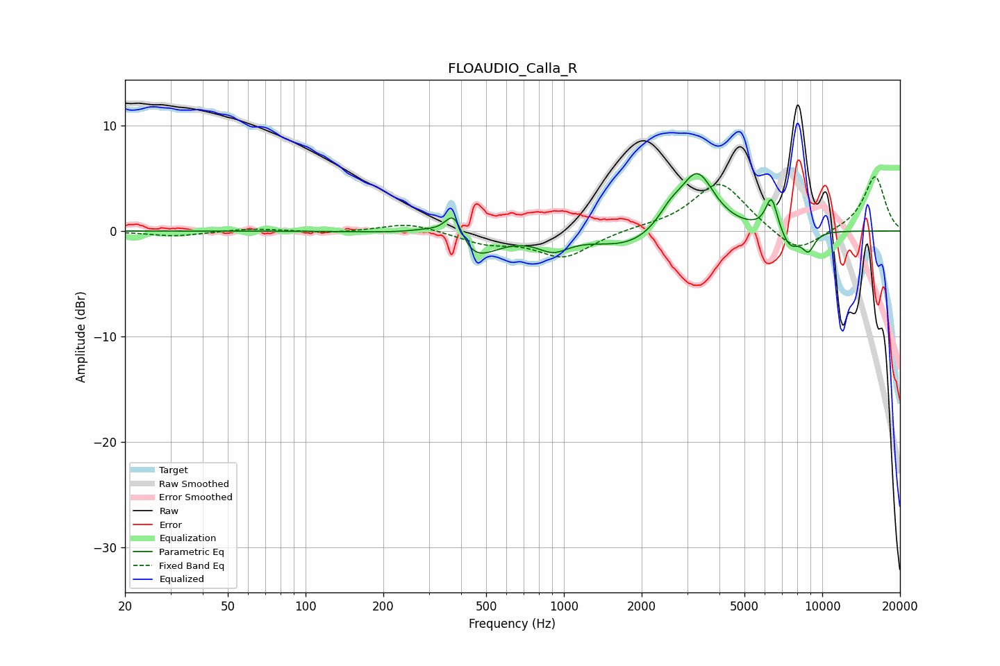

# FLOAUDIO_Calla_R
See [usage instructions](https://github.com/jaakkopasanen/AutoEq#usage) for more options and info.

### Parametric EQs
Apply preamp of -5.5 dB when using parametric equalizer.

|   # | Type    |   Fc (Hz) |    Q |   Gain (dB) |
|-----|---------|-----------|------|-------------|
|   1 | Peaking |       304 | 1.84 |         0.8 |
|   2 | Peaking |       376 | 3.78 |         3.4 |
|   3 | Peaking |       432 | 1.61 |        -3.2 |
|   4 | Peaking |       910 | 2.37 |        -1.4 |
|   5 | Peaking |      1782 | 1.06 |        -1.6 |
|   6 | Peaking |      2582 | 2.92 |         1.5 |
|   7 | Peaking |      3287 | 2.13 |         5.6 |
|   8 | Peaking |      6363 | 5.99 |         3.2 |
|   9 | Peaking |      7501 | 3.7  |        -1.7 |
|  10 | Peaking |      8839 | 5.17 |        -1.8 |

### Fixed Band EQs
When using fixed band (also called graphic) equalizer, apply preamp of **-5.2 dB** (if available) and set gains manually with these parameters.

|   # | Type    |   Fc (Hz) |    Q |   Gain (dB) |
|-----|---------|-----------|------|-------------|
|   1 | Peaking |        31 | 1.41 |        -0.5 |
|   2 | Peaking |        62 | 1.41 |         0.3 |
|   3 | Peaking |       125 | 1.41 |        -0.2 |
|   4 | Peaking |       250 | 1.41 |         0.8 |
|   5 | Peaking |       500 | 1.41 |        -1.1 |
|   6 | Peaking |      1000 | 1.41 |        -2.5 |
|   7 | Peaking |      2000 | 1.41 |         0.3 |
|   8 | Peaking |      4000 | 1.41 |         4.7 |
|   9 | Peaking |      8000 | 1.41 |        -2.3 |
|  10 | Peaking |     16000 | 1.41 |         5.2 |

### Graphs

