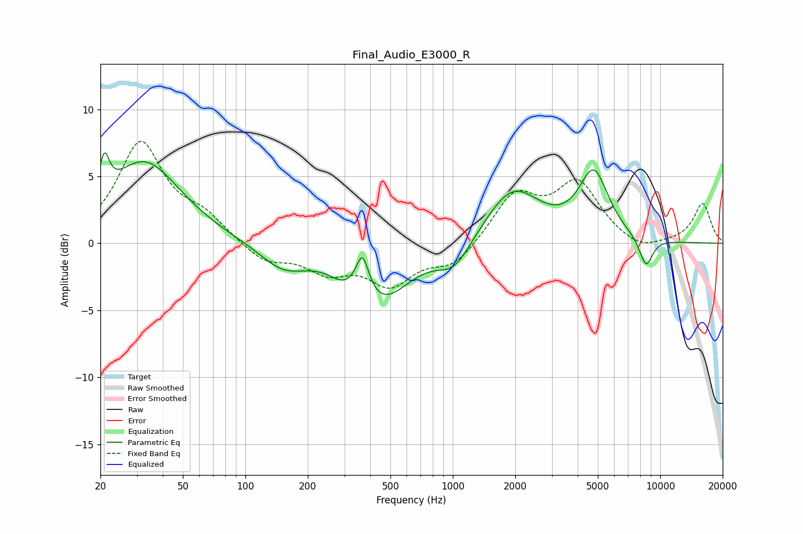

# Final_Audio_E3000_R
See [usage instructions](https://github.com/jaakkopasanen/AutoEq#usage) for more options and info.

### Parametric EQs
Apply preamp of -6.8 dB when using parametric equalizer.

|   # | Type    |   Fc (Hz) |    Q |   Gain (dB) |
|-----|---------|-----------|------|-------------|
|   1 | Peaking |        21 | 6    |         2.9 |
|   2 | Peaking |        33 | 0.81 |         6.1 |
|   3 | Peaking |       152 | 1.21 |        -1.8 |
|   4 | Peaking |       293 | 2.45 |        -0.6 |
|   5 | Peaking |       367 | 4.57 |         2.9 |
|   6 | Peaking |       448 | 0.99 |        -4.2 |
|   7 | Peaking |      1018 | 1.73 |        -2   |
|   8 | Peaking |      1943 | 1.07 |         4.1 |
|   9 | Peaking |      4779 | 1.97 |         4.9 |
|  10 | Peaking |      8536 | 3.95 |        -2.2 |

### Fixed Band EQs
When using fixed band (also called graphic) equalizer, apply preamp of **-7.7 dB** (if available) and set gains manually with these parameters.

|   # | Type    |   Fc (Hz) |    Q |   Gain (dB) |
|-----|---------|-----------|------|-------------|
|   1 | Peaking |        31 | 1.41 |         7.4 |
|   2 | Peaking |        62 | 1.41 |         1.6 |
|   3 | Peaking |       125 | 1.41 |        -1.4 |
|   4 | Peaking |       250 | 1.41 |        -1.9 |
|   5 | Peaking |       500 | 1.41 |        -2.8 |
|   6 | Peaking |      1000 | 1.41 |        -1.7 |
|   7 | Peaking |      2000 | 1.41 |         3.5 |
|   8 | Peaking |      4000 | 1.41 |         4.3 |
|   9 | Peaking |      8000 | 1.41 |        -0.7 |
|  10 | Peaking |     16000 | 1.41 |         3   |

### Graphs

