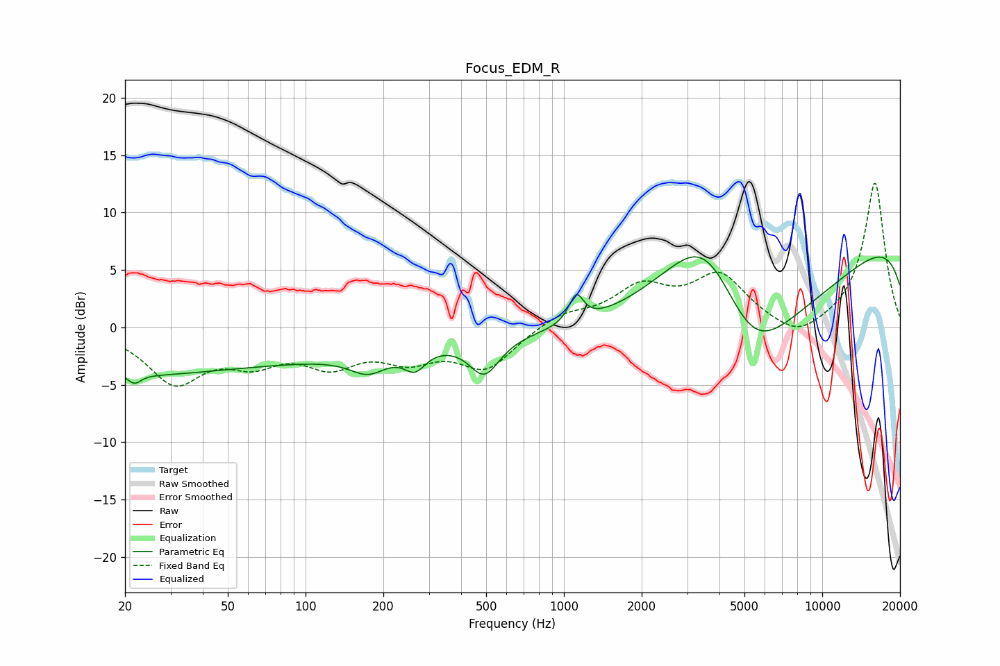

# Focus_EDM_R
See [usage instructions](https://github.com/jaakkopasanen/AutoEq#usage) for more options and info.

### Parametric EQs
Apply preamp of -6.2 dB when using parametric equalizer.

|   # | Type    |   Fc (Hz) |    Q |   Gain (dB) |
|-----|---------|-----------|------|-------------|
|   1 | Peaking |        20 | 0.43 |        -3.3 |
|   2 | Peaking |        22 | 5.57 |        -0.9 |
|   3 | Peaking |        94 | 0.36 |        -2.2 |
|   4 | Peaking |       175 | 1.95 |        -1.7 |
|   5 | Peaking |       265 | 3.4  |        -1.7 |
|   6 | Peaking |       492 | 2.39 |        -3.3 |
|   7 | Peaking |      1116 | 5.05 |         2.4 |
|   8 | Peaking |      3567 | 0.66 |        13.3 |
|   9 | Peaking |      5265 | 0.42 |       -20   |
|  10 | Peaking |     10000 | 0.18 |        11.9 |

### Fixed Band EQs
When using fixed band (also called graphic) equalizer, apply preamp of **-12.7 dB** (if available) and set gains manually with these parameters.

|   # | Type    |   Fc (Hz) |    Q |   Gain (dB) |
|-----|---------|-----------|------|-------------|
|   1 | Peaking |        31 | 1.41 |        -4.5 |
|   2 | Peaking |        62 | 1.41 |        -2.4 |
|   3 | Peaking |       125 | 1.41 |        -2.8 |
|   4 | Peaking |       250 | 1.41 |        -2.3 |
|   5 | Peaking |       500 | 1.41 |        -3.4 |
|   6 | Peaking |      1000 | 1.41 |         1.2 |
|   7 | Peaking |      2000 | 1.41 |         3.2 |
|   8 | Peaking |      4000 | 1.41 |         4.3 |
|   9 | Peaking |      8000 | 1.41 |        -1.5 |
|  10 | Peaking |     16000 | 1.41 |        12.7 |

### Graphs

