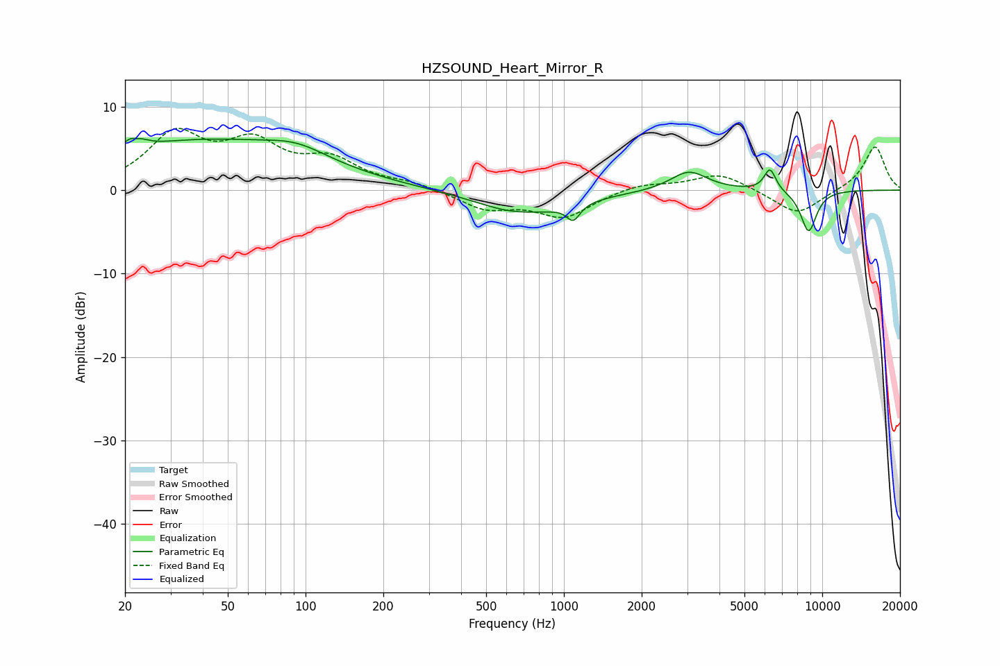

# HZSOUND_Heart_Mirror_R
See [usage instructions](https://github.com/jaakkopasanen/AutoEq#usage) for more options and info.

### Parametric EQs
Apply preamp of -6.3 dB when using parametric equalizer.

|   # | Type    |   Fc (Hz) |    Q |   Gain (dB) |
|-----|---------|-----------|------|-------------|
|   1 | Peaking |        22 | 4.77 |         3.8 |
|   2 | Peaking |        22 | 5.95 |        -2.5 |
|   3 | Peaking |        40 | 0.33 |         5.8 |
|   4 | Peaking |        93 | 1.18 |         1.6 |
|   5 | Peaking |       714 | 0.86 |        -3.4 |
|   6 | Peaking |       731 | 1.61 |         0.6 |
|   7 | Peaking |      1087 | 5.6  |        -1.9 |
|   8 | Peaking |      3046 | 1.99 |         2.4 |
|   9 | Peaking |      6278 | 5.99 |         2.7 |
|  10 | Peaking |      8857 | 4.06 |        -5   |

### Fixed Band EQs
When using fixed band (also called graphic) equalizer, apply preamp of **-7.5 dB** (if available) and set gains manually with these parameters.

|   # | Type    |   Fc (Hz) |    Q |   Gain (dB) |
|-----|---------|-----------|------|-------------|
|   1 | Peaking |        31 | 1.41 |         6.3 |
|   2 | Peaking |        62 | 1.41 |         4.9 |
|   3 | Peaking |       125 | 1.41 |         3.2 |
|   4 | Peaking |       250 | 1.41 |         0.7 |
|   5 | Peaking |       500 | 1.41 |        -2.2 |
|   6 | Peaking |      1000 | 1.41 |        -3.1 |
|   7 | Peaking |      2000 | 1.41 |         0.8 |
|   8 | Peaking |      4000 | 1.41 |         2   |
|   9 | Peaking |      8000 | 1.41 |        -3   |
|  10 | Peaking |     16000 | 1.41 |         5.3 |

### Graphs

