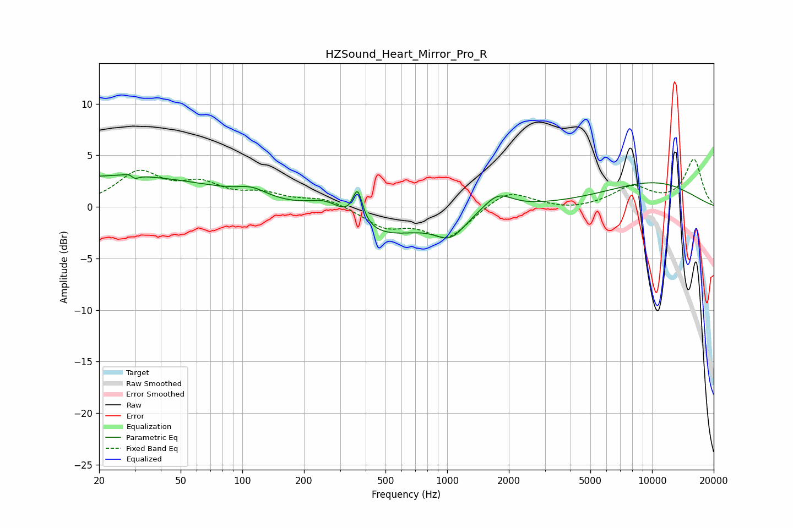

# HZSound_Heart_Mirror_Pro_R
See [usage instructions](https://github.com/jaakkopasanen/AutoEq#usage) for more options and info.

### Parametric EQs
Apply preamp of -3.2 dB when using parametric equalizer.

|   # | Type    |   Fc (Hz) |    Q |   Gain (dB) |
|-----|---------|-----------|------|-------------|
|   1 | Peaking |        24 | 0.27 |         3   |
|   2 | Peaking |        29 | 5.42 |         2.2 |
|   3 | Peaking |        30 | 6    |        -2.4 |
|   4 | Peaking |       112 | 1.98 |         0.8 |
|   5 | Peaking |       259 | 1.54 |         1.6 |
|   6 | Peaking |       365 | 5.95 |         3.1 |
|   7 | Peaking |       474 | 0.66 |        -2.8 |
|   8 | Peaking |      1037 | 1.9  |        -2.1 |
|   9 | Peaking |      1766 | 2.06 |         1.6 |
|  10 | Peaking |     10000 | 0.51 |         2.3 |

### Fixed Band EQs
When using fixed band (also called graphic) equalizer, apply preamp of **-4.7 dB** (if available) and set gains manually with these parameters.

|   # | Type    |   Fc (Hz) |    Q |   Gain (dB) |
|-----|---------|-----------|------|-------------|
|   1 | Peaking |        31 | 1.41 |         3.2 |
|   2 | Peaking |        62 | 1.41 |         1.9 |
|   3 | Peaking |       125 | 1.41 |         1.1 |
|   4 | Peaking |       250 | 1.41 |         0.8 |
|   5 | Peaking |       500 | 1.41 |        -1.8 |
|   6 | Peaking |      1000 | 1.41 |        -3   |
|   7 | Peaking |      2000 | 1.41 |         1.7 |
|   8 | Peaking |      4000 | 1.41 |        -0.3 |
|   9 | Peaking |      8000 | 1.41 |         1.9 |
|  10 | Peaking |     16000 | 1.41 |         4.5 |

### Graphs

