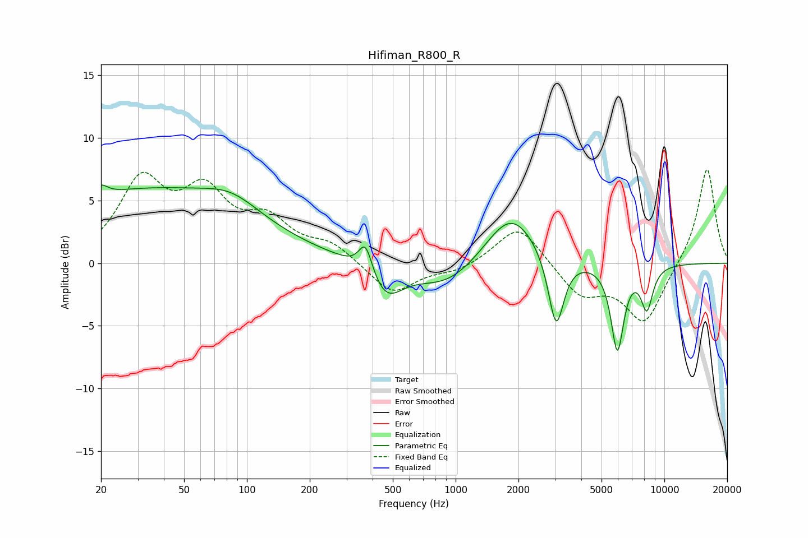

# Hifiman_R800_R
See [usage instructions](https://github.com/jaakkopasanen/AutoEq#usage) for more options and info.

### Parametric EQs
Apply preamp of -6.3 dB when using parametric equalizer.

|   # | Type    |   Fc (Hz) |    Q |   Gain (dB) |
|-----|---------|-----------|------|-------------|
|   1 | Peaking |        20 | 4.7  |         0.8 |
|   2 | Peaking |        32 | 0.27 |         5.7 |
|   3 | Peaking |        85 | 1.05 |         1.5 |
|   4 | Peaking |       370 | 4.46 |         2.4 |
|   5 | Peaking |       464 | 1.84 |        -2.6 |
|   6 | Peaking |       908 | 0.91 |        -2.1 |
|   7 | Peaking |      1843 | 1.14 |         4.3 |
|   8 | Peaking |      3029 | 3.8  |        -6   |
|   9 | Peaking |      5957 | 4.5  |        -6.8 |
|  10 | Peaking |      8248 | 4.58 |        -3.3 |

### Fixed Band EQs
When using fixed band (also called graphic) equalizer, apply preamp of **-7.5 dB** (if available) and set gains manually with these parameters.

|   # | Type    |   Fc (Hz) |    Q |   Gain (dB) |
|-----|---------|-----------|------|-------------|
|   1 | Peaking |        31 | 1.41 |         6.2 |
|   2 | Peaking |        62 | 1.41 |         4.9 |
|   3 | Peaking |       125 | 1.41 |         2.9 |
|   4 | Peaking |       250 | 1.41 |         1.4 |
|   5 | Peaking |       500 | 1.41 |        -2.5 |
|   6 | Peaking |      1000 | 1.41 |        -0.6 |
|   7 | Peaking |      2000 | 1.41 |         3.2 |
|   8 | Peaking |      4000 | 1.41 |        -2.5 |
|   9 | Peaking |      8000 | 1.41 |        -4.7 |
|  10 | Peaking |     16000 | 1.41 |         7.7 |

### Graphs

