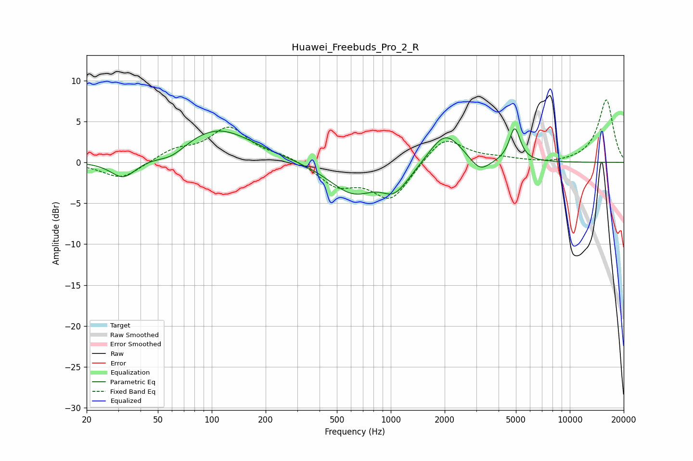

# Huawei_Freebuds_Pro_2_R
See [usage instructions](https://github.com/jaakkopasanen/AutoEq#usage) for more options and info.

### Parametric EQs
Apply preamp of -4.2 dB when using parametric equalizer.

|   # | Type    |   Fc (Hz) |    Q |   Gain (dB) |
|-----|---------|-----------|------|-------------|
|   1 | Peaking |        32 | 1.99 |        -2.3 |
|   2 | Peaking |        60 | 1.65 |        -1.3 |
|   3 | Peaking |       106 | 0.69 |         4.2 |
|   4 | Peaking |       619 | 1.04 |        -3.8 |
|   5 | Peaking |       911 | 1.56 |         0.8 |
|   6 | Peaking |      1030 | 1.83 |        -2.9 |
|   7 | Peaking |      1169 | 1.37 |        -0.7 |
|   8 | Peaking |      2018 | 1.54 |         4   |
|   9 | Peaking |      3147 | 2.48 |        -1.8 |
|  10 | Peaking |      4924 | 4.61 |         4.1 |

### Fixed Band EQs
When using fixed band (also called graphic) equalizer, apply preamp of **-7.7 dB** (if available) and set gains manually with these parameters.

|   # | Type    |   Fc (Hz) |    Q |   Gain (dB) |
|-----|---------|-----------|------|-------------|
|   1 | Peaking |        31 | 1.41 |        -2.1 |
|   2 | Peaking |        62 | 1.41 |         1.4 |
|   3 | Peaking |       125 | 1.41 |         4.1 |
|   4 | Peaking |       250 | 1.41 |         0.7 |
|   5 | Peaking |       500 | 1.41 |        -2.7 |
|   6 | Peaking |      1000 | 1.41 |        -4.5 |
|   7 | Peaking |      2000 | 1.41 |         3.3 |
|   8 | Peaking |      4000 | 1.41 |         0.4 |
|   9 | Peaking |      8000 | 1.41 |        -0.2 |
|  10 | Peaking |     16000 | 1.41 |         7.7 |

### Graphs

