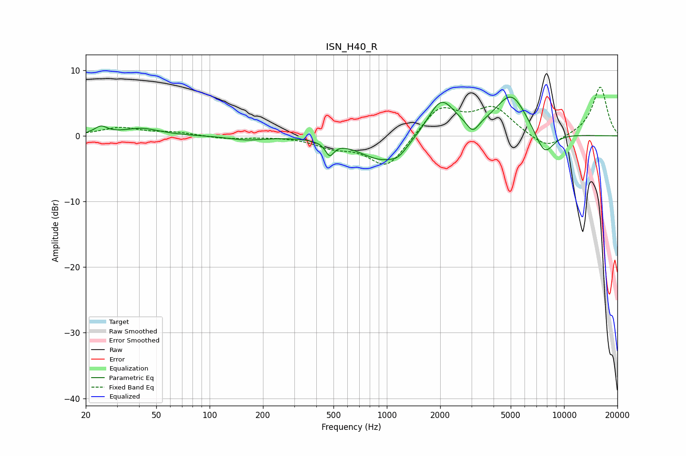

# ISN_H40_R
See [usage instructions](https://github.com/jaakkopasanen/AutoEq#usage) for more options and info.

### Parametric EQs
Apply preamp of -6.0 dB when using parametric equalizer.

|   # | Type    |   Fc (Hz) |    Q |   Gain (dB) |
|-----|---------|-----------|------|-------------|
|   1 | Peaking |        24 | 3.95 |         1.2 |
|   2 | Peaking |        41 | 1.4  |         1.1 |
|   3 | Peaking |       161 | 1.47 |        -0.6 |
|   4 | Peaking |       476 | 6    |        -2   |
|   5 | Peaking |       955 | 1.06 |        -3.9 |
|   6 | Peaking |      1167 | 3.2  |        -1   |
|   7 | Peaking |      2027 | 1.81 |         5.7 |
|   8 | Peaking |      3055 | 4.29 |        -1.9 |
|   9 | Peaking |      5037 | 1.52 |         6.3 |
|  10 | Peaking |      7748 | 2.43 |        -4   |

### Fixed Band EQs
When using fixed band (also called graphic) equalizer, apply preamp of **-7.5 dB** (if available) and set gains manually with these parameters.

|   # | Type    |   Fc (Hz) |    Q |   Gain (dB) |
|-----|---------|-----------|------|-------------|
|   1 | Peaking |        31 | 1.41 |         1.2 |
|   2 | Peaking |        62 | 1.41 |         0.5 |
|   3 | Peaking |       125 | 1.41 |        -0.4 |
|   4 | Peaking |       250 | 1.41 |        -0   |
|   5 | Peaking |       500 | 1.41 |        -1.4 |
|   6 | Peaking |      1000 | 1.41 |        -4.9 |
|   7 | Peaking |      2000 | 1.41 |         4.5 |
|   8 | Peaking |      4000 | 1.41 |         4.1 |
|   9 | Peaking |      8000 | 1.41 |        -2.2 |
|  10 | Peaking |     16000 | 1.41 |         7.5 |

### Graphs

