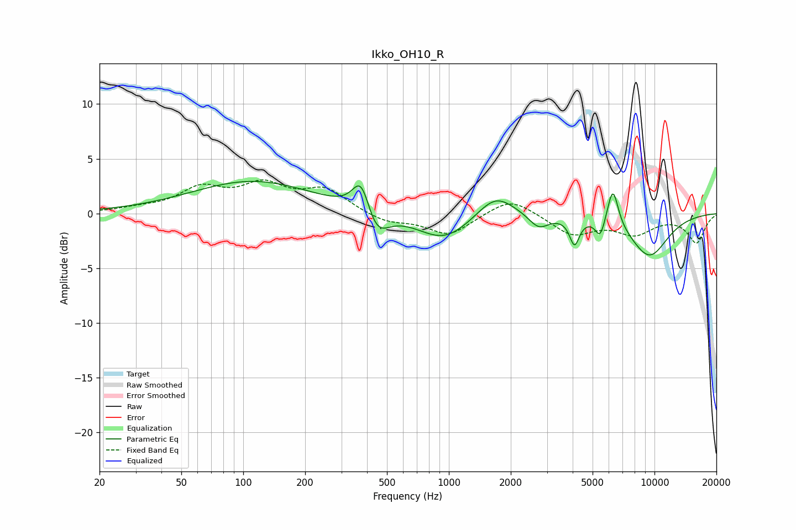

# Ikko_OH10_R
See [usage instructions](https://github.com/jaakkopasanen/AutoEq#usage) for more options and info.

### Parametric EQs
Apply preamp of -3.0 dB when using parametric equalizer.

|   # | Type    |   Fc (Hz) |    Q |   Gain (dB) |
|-----|---------|-----------|------|-------------|
|   1 | Peaking |       111 | 0.47 |         3   |
|   2 | Peaking |       374 | 3.36 |         3.2 |
|   3 | Peaking |       445 | 2.51 |        -2.5 |
|   4 | Peaking |       949 | 1.07 |        -2.5 |
|   5 | Peaking |      1686 | 1.55 |         2.2 |
|   6 | Peaking |      2735 | 2.89 |        -1.3 |
|   7 | Peaking |      4084 | 6    |        -2.4 |
|   8 | Peaking |      5448 | 6    |        -1.7 |
|   9 | Peaking |      6273 | 5.09 |         3.6 |
|  10 | Peaking |      9425 | 1.3  |        -3.9 |

### Fixed Band EQs
When using fixed band (also called graphic) equalizer, apply preamp of **-3.2 dB** (if available) and set gains manually with these parameters.

|   # | Type    |   Fc (Hz) |    Q |   Gain (dB) |
|-----|---------|-----------|------|-------------|
|   1 | Peaking |        31 | 1.41 |         0.3 |
|   2 | Peaking |        62 | 1.41 |         2.1 |
|   3 | Peaking |       125 | 1.41 |         2.3 |
|   4 | Peaking |       250 | 1.41 |         2.1 |
|   5 | Peaking |       500 | 1.41 |        -0.8 |
|   6 | Peaking |      1000 | 1.41 |        -2   |
|   7 | Peaking |      2000 | 1.41 |         1.6 |
|   8 | Peaking |      4000 | 1.41 |        -1.9 |
|   9 | Peaking |      8000 | 1.41 |        -1.7 |
|  10 | Peaking |     16000 | 1.41 |        -2.6 |

### Graphs

