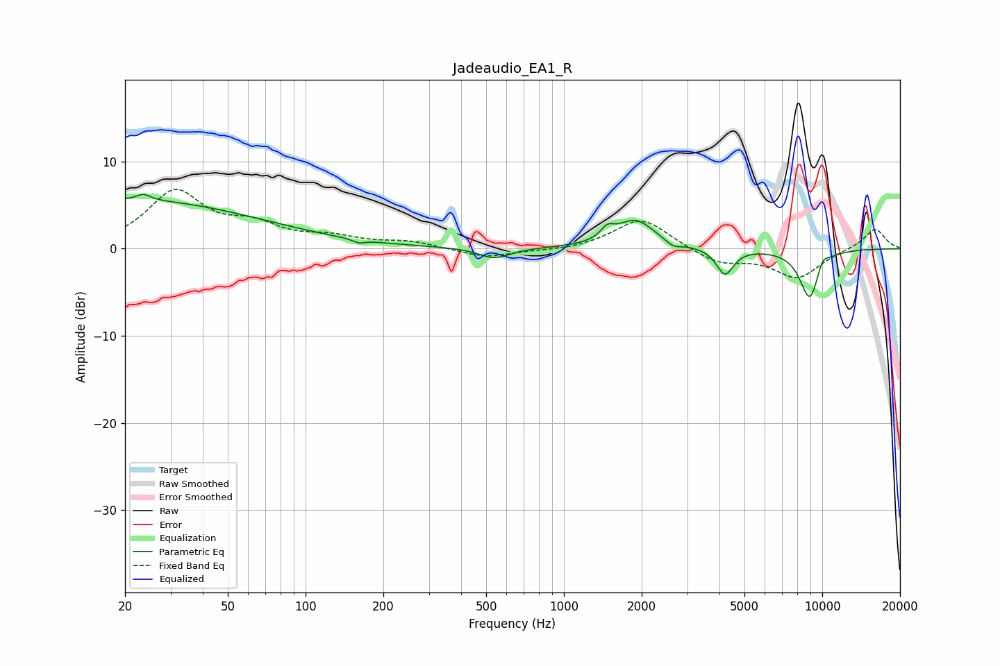

# Jadeaudio_EA1_R
See [usage instructions](https://github.com/jaakkopasanen/AutoEq#usage) for more options and info.

### Parametric EQs
Apply preamp of -6.3 dB when using parametric equalizer.

|   # | Type    |   Fc (Hz) |    Q |   Gain (dB) |
|-----|---------|-----------|------|-------------|
|   1 | Peaking |        20 | 0.26 |         5.6 |
|   2 | Peaking |        24 | 5.65 |         0.7 |
|   3 | Peaking |       161 | 5.99 |        -0.4 |
|   4 | Peaking |       538 | 2.36 |        -1.2 |
|   5 | Peaking |      1473 | 5.81 |         1.1 |
|   6 | Peaking |      1885 | 1.85 |         3.3 |
|   7 | Peaking |      2647 | 4.73 |        -0.7 |
|   8 | Peaking |      4204 | 4.32 |        -3   |
|   9 | Peaking |      8954 | 3.25 |        -5.8 |
|  10 | Peaking |     10000 | 5.4  |         1.3 |

### Fixed Band EQs
When using fixed band (also called graphic) equalizer, apply preamp of **-6.9 dB** (if available) and set gains manually with these parameters.

|   # | Type    |   Fc (Hz) |    Q |   Gain (dB) |
|-----|---------|-----------|------|-------------|
|   1 | Peaking |        31 | 1.41 |         6.4 |
|   2 | Peaking |        62 | 1.41 |         2.2 |
|   3 | Peaking |       125 | 1.41 |         1.1 |
|   4 | Peaking |       250 | 1.41 |         0.7 |
|   5 | Peaking |       500 | 1.41 |        -1.1 |
|   6 | Peaking |      1000 | 1.41 |        -0.3 |
|   7 | Peaking |      2000 | 1.41 |         3.6 |
|   8 | Peaking |      4000 | 1.41 |        -1.7 |
|   9 | Peaking |      8000 | 1.41 |        -3.3 |
|  10 | Peaking |     16000 | 1.41 |         2.4 |

### Graphs

