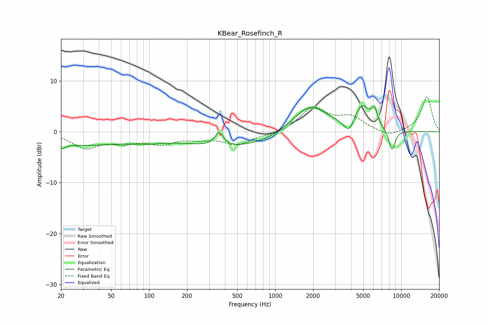

# KBear_Rosefinch_R
See [usage instructions](https://github.com/jaakkopasanen/AutoEq#usage) for more options and info.

### Parametric EQs
Apply preamp of -5.2 dB when using parametric equalizer.

|   # | Type    |   Fc (Hz) |    Q |   Gain (dB) |
|-----|---------|-----------|------|-------------|
|   1 | Peaking |        20 | 5.04 |        -1   |
|   2 | Peaking |        30 | 0.43 |        -2.5 |
|   3 | Peaking |        98 | 1.01 |        -0.8 |
|   4 | Peaking |       359 | 4.48 |         2.7 |
|   5 | Peaking |       513 | 0.36 |        -3.1 |
|   6 | Peaking |      1874 | 0.97 |         5.9 |
|   7 | Peaking |      3861 | 3.43 |        -2.9 |
|   8 | Peaking |      4867 | 2.21 |         4.8 |
|   9 | Peaking |      6145 | 5.87 |         2.9 |
|  10 | Peaking |      8454 | 4.98 |        -4.2 |

### Fixed Band EQs
When using fixed band (also called graphic) equalizer, apply preamp of **-6.9 dB** (if available) and set gains manually with these parameters.

|   # | Type    |   Fc (Hz) |    Q |   Gain (dB) |
|-----|---------|-----------|------|-------------|
|   1 | Peaking |        31 | 1.41 |        -3   |
|   2 | Peaking |        62 | 1.41 |        -1.7 |
|   3 | Peaking |       125 | 1.41 |        -2   |
|   4 | Peaking |       250 | 1.41 |        -1   |
|   5 | Peaking |       500 | 1.41 |        -2.4 |
|   6 | Peaking |      1000 | 1.41 |        -0.6 |
|   7 | Peaking |      2000 | 1.41 |         4.6 |
|   8 | Peaking |      4000 | 1.41 |         2.6 |
|   9 | Peaking |      8000 | 1.41 |        -1.1 |
|  10 | Peaking |     16000 | 1.41 |         6.9 |

### Graphs

