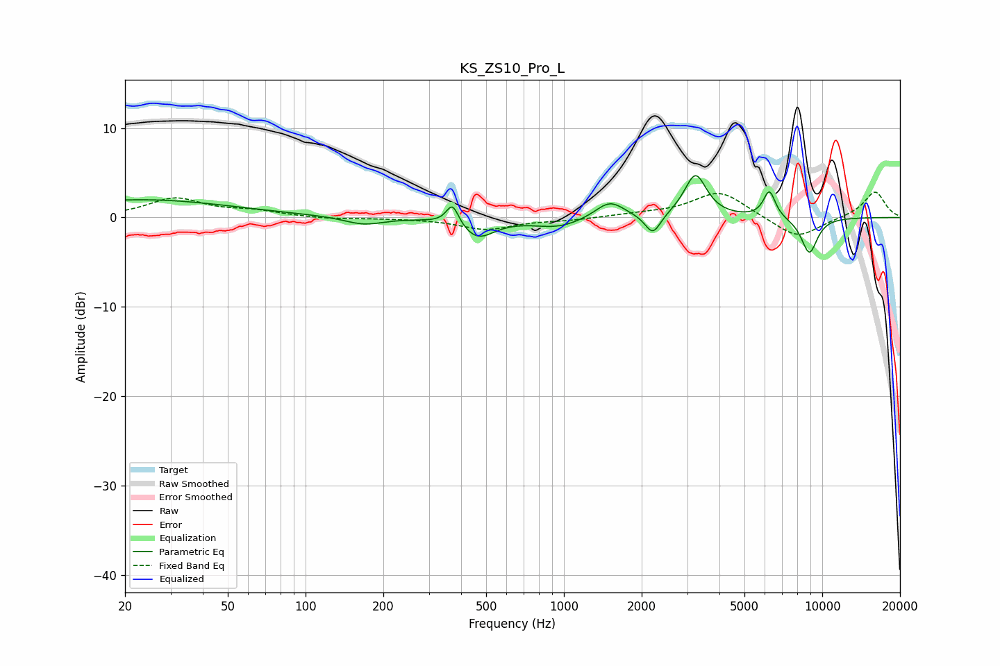

# KS_ZS10_Pro_L
See [usage instructions](https://github.com/jaakkopasanen/AutoEq#usage) for more options and info.

### Parametric EQs
Apply preamp of -4.8 dB when using parametric equalizer.

|   # | Type    |   Fc (Hz) |    Q |   Gain (dB) |
|-----|---------|-----------|------|-------------|
|   1 | Peaking |        23 | 0.41 |         2   |
|   2 | Peaking |       168 | 1.89 |        -0.9 |
|   3 | Peaking |       370 | 5.99 |         2.4 |
|   4 | Peaking |       464 | 2.24 |        -2.2 |
|   5 | Peaking |       950 | 1.47 |        -1.1 |
|   6 | Peaking |      1505 | 2.54 |         1.9 |
|   7 | Peaking |      2209 | 4.69 |        -2.3 |
|   8 | Peaking |      3231 | 3.32 |         4.8 |
|   9 | Peaking |      6244 | 5.9  |         3   |
|  10 | Peaking |      8915 | 4    |        -4   |

### Fixed Band EQs
When using fixed band (also called graphic) equalizer, apply preamp of **-2.9 dB** (if available) and set gains manually with these parameters.

|   # | Type    |   Fc (Hz) |    Q |   Gain (dB) |
|-----|---------|-----------|------|-------------|
|   1 | Peaking |        31 | 1.41 |         2.1 |
|   2 | Peaking |        62 | 1.41 |         0.6 |
|   3 | Peaking |       125 | 1.41 |        -0.2 |
|   4 | Peaking |       250 | 1.41 |        -0.1 |
|   5 | Peaking |       500 | 1.41 |        -1.3 |
|   6 | Peaking |      1000 | 1.41 |        -0.3 |
|   7 | Peaking |      2000 | 1.41 |         0.3 |
|   8 | Peaking |      4000 | 1.41 |         3   |
|   9 | Peaking |      8000 | 1.41 |        -2.4 |
|  10 | Peaking |     16000 | 1.41 |         2.9 |

### Graphs

