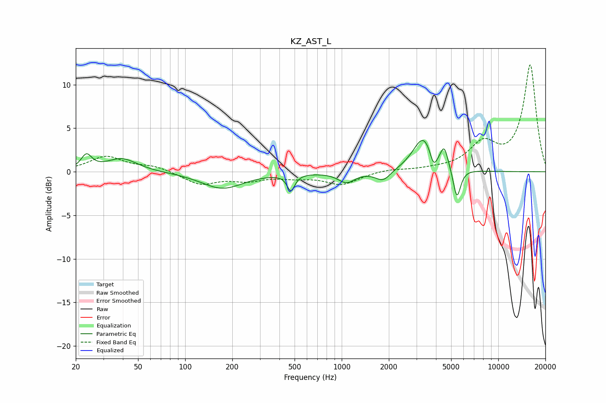

# KZ_AST_L
See [usage instructions](https://github.com/jaakkopasanen/AutoEq#usage) for more options and info.

### Parametric EQs
Apply preamp of -3.7 dB when using parametric equalizer.

|   # | Type    |   Fc (Hz) |    Q |   Gain (dB) |
|-----|---------|-----------|------|-------------|
|   1 | Peaking |        23 | 4.24 |         1.7 |
|   2 | Peaking |        39 | 1.46 |         1.5 |
|   3 | Peaking |       173 | 1.06 |        -1.9 |
|   4 | Peaking |       474 | 6    |        -1.9 |
|   5 | Peaking |      1073 | 2.66 |        -1.2 |
|   6 | Peaking |      1838 | 2.94 |        -1.2 |
|   7 | Peaking |      3330 | 2.13 |         4   |
|   8 | Peaking |      3862 | 6    |        -1.9 |
|   9 | Peaking |      4521 | 5.9  |         2.2 |
|  10 | Peaking |      5442 | 5.87 |        -3.5 |

### Fixed Band EQs
When using fixed band (also called graphic) equalizer, apply preamp of **-12.4 dB** (if available) and set gains manually with these parameters.

|   # | Type    |   Fc (Hz) |    Q |   Gain (dB) |
|-----|---------|-----------|------|-------------|
|   1 | Peaking |        31 | 1.41 |         1.7 |
|   2 | Peaking |        62 | 1.41 |         0.6 |
|   3 | Peaking |       125 | 1.41 |        -1.4 |
|   4 | Peaking |       250 | 1.41 |        -0.9 |
|   5 | Peaking |       500 | 1.41 |        -0.5 |
|   6 | Peaking |      1000 | 1.41 |        -1.4 |
|   7 | Peaking |      2000 | 1.41 |         0.3 |
|   8 | Peaking |      4000 | 1.41 |         0.2 |
|   9 | Peaking |      8000 | 1.41 |         3   |
|  10 | Peaking |     16000 | 1.41 |        12.2 |

### Graphs

