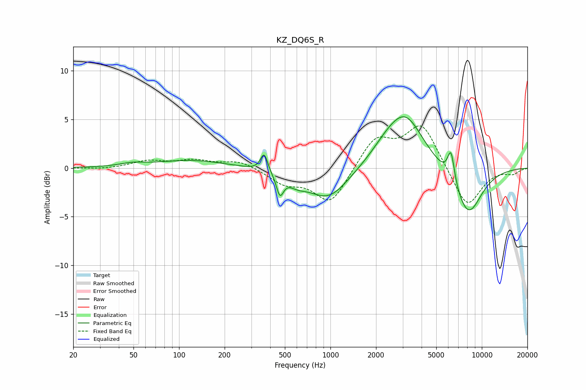

# KZ_DQ6S_R
See [usage instructions](https://github.com/jaakkopasanen/AutoEq#usage) for more options and info.

### Parametric EQs
Apply preamp of -5.4 dB when using parametric equalizer.

|   # | Type    |   Fc (Hz) |    Q |   Gain (dB) |
|-----|---------|-----------|------|-------------|
|   1 | Peaking |        49 | 1.82 |         0.3 |
|   2 | Peaking |       122 | 0.62 |         0.8 |
|   3 | Peaking |       365 | 6    |         1.9 |
|   4 | Peaking |       464 | 5.99 |        -2.1 |
|   5 | Peaking |       602 | 2.27 |        -0.8 |
|   6 | Peaking |       966 | 1.05 |        -3.2 |
|   7 | Peaking |      2329 | 1.3  |         1.3 |
|   8 | Peaking |      3134 | 1.17 |         5.1 |
|   9 | Peaking |      6257 | 6    |         3.2 |
|  10 | Peaking |      8102 | 1.4  |        -5   |

### Fixed Band EQs
When using fixed band (also called graphic) equalizer, apply preamp of **-4.4 dB** (if available) and set gains manually with these parameters.

|   # | Type    |   Fc (Hz) |    Q |   Gain (dB) |
|-----|---------|-----------|------|-------------|
|   1 | Peaking |        31 | 1.41 |        -0.1 |
|   2 | Peaking |        62 | 1.41 |         0.7 |
|   3 | Peaking |       125 | 1.41 |         0.7 |
|   4 | Peaking |       250 | 1.41 |         0.8 |
|   5 | Peaking |       500 | 1.41 |        -1.4 |
|   6 | Peaking |      1000 | 1.41 |        -3.7 |
|   7 | Peaking |      2000 | 1.41 |         3.1 |
|   8 | Peaking |      4000 | 1.41 |         4.5 |
|   9 | Peaking |      8000 | 1.41 |        -4.2 |
|  10 | Peaking |     16000 | 1.41 |        -0.5 |

### Graphs

