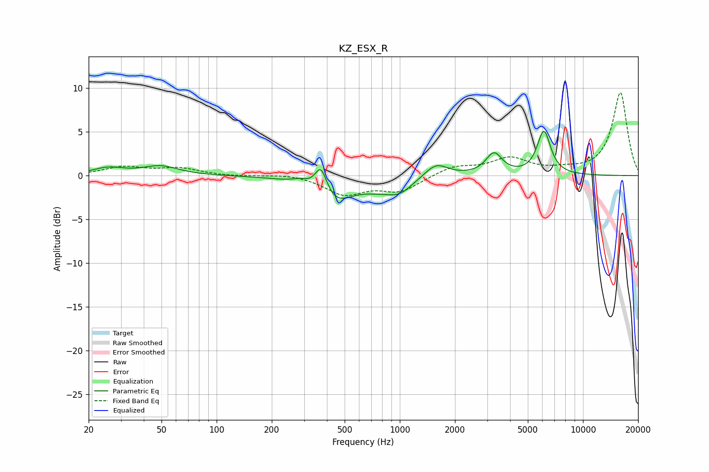

# KZ_ESX_R
See [usage instructions](https://github.com/jaakkopasanen/AutoEq#usage) for more options and info.

### Parametric EQs
Apply preamp of -5.2 dB when using parametric equalizer.

|   # | Type    |   Fc (Hz) |    Q |   Gain (dB) |
|-----|---------|-----------|------|-------------|
|   1 | Peaking |        26 | 1.7  |         0.8 |
|   2 | Peaking |        49 | 1.48 |         1   |
|   3 | Peaking |       288 | 3.14 |         0.6 |
|   4 | Peaking |       372 | 4.07 |         3.4 |
|   5 | Peaking |       428 | 1.35 |        -3.2 |
|   6 | Peaking |       759 | 1.64 |        -0.7 |
|   7 | Peaking |       996 | 1.93 |        -1.6 |
|   8 | Peaking |      1578 | 2.24 |         1.6 |
|   9 | Peaking |      3268 | 3.2  |         2.4 |
|  10 | Peaking |      6119 | 3.78 |         5   |

### Fixed Band EQs
When using fixed band (also called graphic) equalizer, apply preamp of **-9.6 dB** (if available) and set gains manually with these parameters.

|   # | Type    |   Fc (Hz) |    Q |   Gain (dB) |
|-----|---------|-----------|------|-------------|
|   1 | Peaking |        31 | 1.41 |         0.9 |
|   2 | Peaking |        62 | 1.41 |         0.8 |
|   3 | Peaking |       125 | 1.41 |        -0.1 |
|   4 | Peaking |       250 | 1.41 |         0.3 |
|   5 | Peaking |       500 | 1.41 |        -2.1 |
|   6 | Peaking |      1000 | 1.41 |        -1.7 |
|   7 | Peaking |      2000 | 1.41 |         1   |
|   8 | Peaking |      4000 | 1.41 |         1.9 |
|   9 | Peaking |      8000 | 1.41 |         0.4 |
|  10 | Peaking |     16000 | 1.41 |         9.5 |

### Graphs

