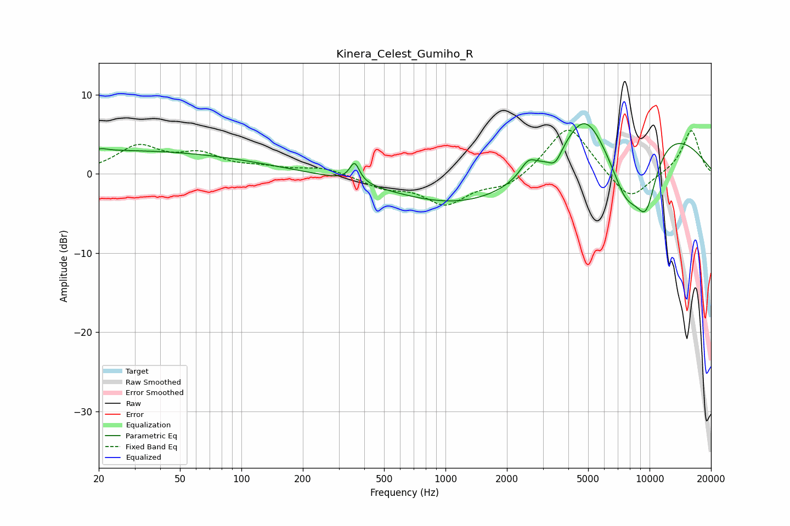

# Kinera_Celest_Gumiho_R
See [usage instructions](https://github.com/jaakkopasanen/AutoEq#usage) for more options and info.

### Parametric EQs
Apply preamp of -6.4 dB when using parametric equalizer.

|   # | Type    |   Fc (Hz) |    Q |   Gain (dB) |
|-----|---------|-----------|------|-------------|
|   1 | Peaking |        21 | 5.28 |         0.2 |
|   2 | Peaking |        23 | 0.18 |         2.9 |
|   3 | Peaking |       359 | 5.95 |         2.4 |
|   4 | Peaking |      1821 | 0.34 |        -6.6 |
|   5 | Peaking |      2544 | 3.62 |         1.8 |
|   6 | Peaking |      3450 | 4.29 |        -1.8 |
|   7 | Peaking |      4804 | 1.59 |         4.5 |
|   8 | Peaking |      6704 | 0.28 |         9.3 |
|   9 | Peaking |      7645 | 1.45 |        -8.5 |
|  10 | Peaking |      9616 | 2.19 |        -7.6 |

### Fixed Band EQs
When using fixed band (also called graphic) equalizer, apply preamp of **-5.6 dB** (if available) and set gains manually with these parameters.

|   # | Type    |   Fc (Hz) |    Q |   Gain (dB) |
|-----|---------|-----------|------|-------------|
|   1 | Peaking |        31 | 1.41 |         3.3 |
|   2 | Peaking |        62 | 1.41 |         2.2 |
|   3 | Peaking |       125 | 1.41 |         0.6 |
|   4 | Peaking |       250 | 1.41 |         0.8 |
|   5 | Peaking |       500 | 1.41 |        -1.5 |
|   6 | Peaking |      1000 | 1.41 |        -3.6 |
|   7 | Peaking |      2000 | 1.41 |        -1.7 |
|   8 | Peaking |      4000 | 1.41 |         6.4 |
|   9 | Peaking |      8000 | 1.41 |        -3.7 |
|  10 | Peaking |     16000 | 1.41 |         5.6 |

### Graphs

