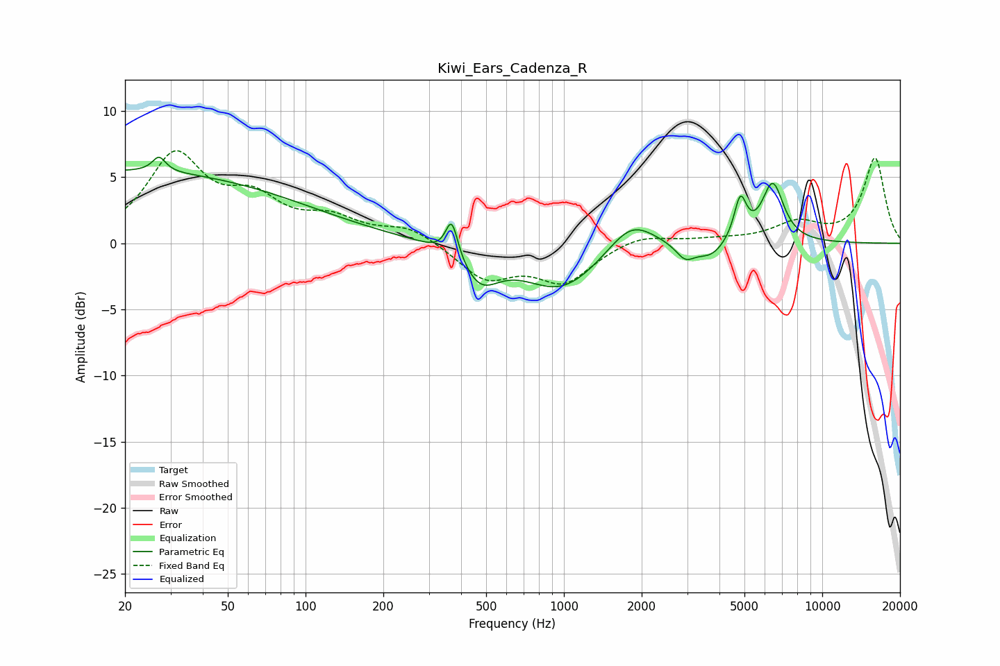

# Kiwi_Ears_Cadenza_R
See [usage instructions](https://github.com/jaakkopasanen/AutoEq#usage) for more options and info.

### Parametric EQs
Apply preamp of -6.6 dB when using parametric equalizer.

|   # | Type    |   Fc (Hz) |    Q |   Gain (dB) |
|-----|---------|-----------|------|-------------|
|   1 | Peaking |        20 | 0.19 |         5.4 |
|   2 | Peaking |        27 | 5.65 |         1.1 |
|   3 | Peaking |       368 | 6    |         2.8 |
|   4 | Peaking |       475 | 1.97 |        -2.5 |
|   5 | Peaking |       978 | 0.93 |        -3.5 |
|   6 | Peaking |      1825 | 1.54 |         2.4 |
|   7 | Peaking |      2948 | 3.84 |        -1.2 |
|   8 | Peaking |      3709 | 2.52 |        -1.1 |
|   9 | Peaking |      4819 | 5.81 |         3.2 |
|  10 | Peaking |      6432 | 3.23 |         4.4 |

### Fixed Band EQs
When using fixed band (also called graphic) equalizer, apply preamp of **-7.1 dB** (if available) and set gains manually with these parameters.

|   # | Type    |   Fc (Hz) |    Q |   Gain (dB) |
|-----|---------|-----------|------|-------------|
|   1 | Peaking |        31 | 1.41 |         6.4 |
|   2 | Peaking |        62 | 1.41 |         2.8 |
|   3 | Peaking |       125 | 1.41 |         1.6 |
|   4 | Peaking |       250 | 1.41 |         1.2 |
|   5 | Peaking |       500 | 1.41 |        -2.6 |
|   6 | Peaking |      1000 | 1.41 |        -2.8 |
|   7 | Peaking |      2000 | 1.41 |         0.8 |
|   8 | Peaking |      4000 | 1.41 |         0.2 |
|   9 | Peaking |      8000 | 1.41 |         1.4 |
|  10 | Peaking |     16000 | 1.41 |         6.4 |

### Graphs

