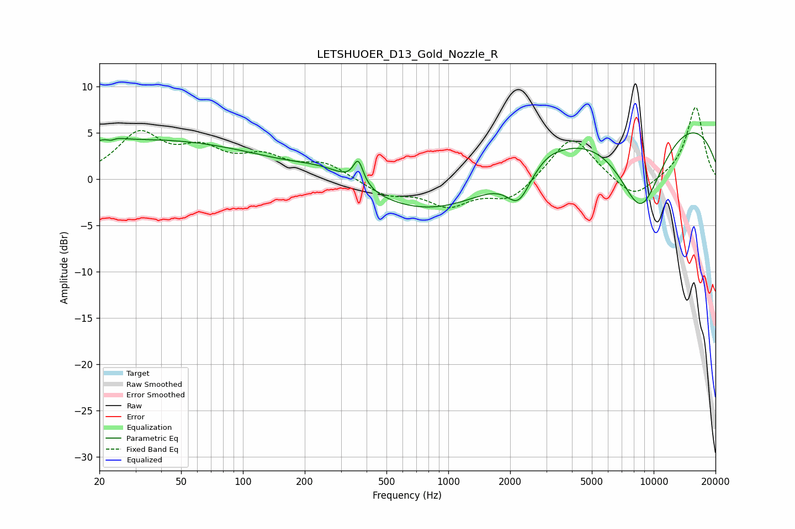

# LETSHUOER_D13_Gold_Nozzle_R
See [usage instructions](https://github.com/jaakkopasanen/AutoEq#usage) for more options and info.

### Parametric EQs
Apply preamp of -5.1 dB when using parametric equalizer.

|   # | Type    |   Fc (Hz) |    Q |   Gain (dB) |
|-----|---------|-----------|------|-------------|
|   1 | Peaking |        23 | 4.38 |         4.3 |
|   2 | Peaking |        23 | 4.83 |        -4.1 |
|   3 | Peaking |        35 | 0.24 |         4.2 |
|   4 | Peaking |       257 | 0.94 |         1.6 |
|   5 | Peaking |       364 | 5.84 |         2.6 |
|   6 | Peaking |       916 | 0.39 |        -4.4 |
|   7 | Peaking |      2201 | 2.42 |        -3.6 |
|   8 | Peaking |      3062 | 2.98 |         0.3 |
|   9 | Peaking |      8646 | 1.02 |       -10.9 |
|  10 | Peaking |      8812 | 0.21 |         8.6 |

### Fixed Band EQs
When using fixed band (also called graphic) equalizer, apply preamp of **-7.9 dB** (if available) and set gains manually with these parameters.

|   # | Type    |   Fc (Hz) |    Q |   Gain (dB) |
|-----|---------|-----------|------|-------------|
|   1 | Peaking |        31 | 1.41 |         4.7 |
|   2 | Peaking |        62 | 1.41 |         2.7 |
|   3 | Peaking |       125 | 1.41 |         2.1 |
|   4 | Peaking |       250 | 1.41 |         1.6 |
|   5 | Peaking |       500 | 1.41 |        -1.6 |
|   6 | Peaking |      1000 | 1.41 |        -2.6 |
|   7 | Peaking |      2000 | 1.41 |        -2.2 |
|   8 | Peaking |      4000 | 1.41 |         4.9 |
|   9 | Peaking |      8000 | 1.41 |        -2.4 |
|  10 | Peaking |     16000 | 1.41 |         7.9 |

### Graphs

