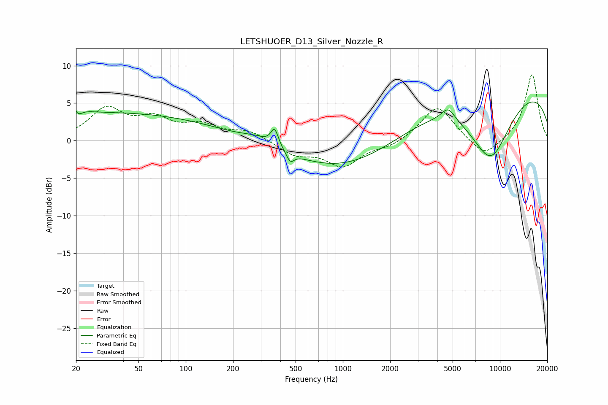

# LETSHUOER_D13_Silver_Nozzle_R
See [usage instructions](https://github.com/jaakkopasanen/AutoEq#usage) for more options and info.

### Parametric EQs
Apply preamp of -5.3 dB when using parametric equalizer.

|   # | Type    |   Fc (Hz) |    Q |   Gain (dB) |
|-----|---------|-----------|------|-------------|
|   1 | Peaking |        20 | 3.78 |         3.4 |
|   2 | Peaking |        20 | 4.68 |        -3.3 |
|   3 | Peaking |        31 | 0.18 |         3.7 |
|   4 | Peaking |       284 | 1.59 |         0.8 |
|   5 | Peaking |       368 | 5.85 |         2.4 |
|   6 | Peaking |       463 | 6    |        -1.3 |
|   7 | Peaking |      1126 | 0.39 |        -4.5 |
|   8 | Peaking |      4686 | 3.29 |         1.7 |
|   9 | Peaking |      8709 | 0.93 |        -9.5 |
|  10 | Peaking |      9774 | 0.18 |         7.8 |

### Fixed Band EQs
When using fixed band (also called graphic) equalizer, apply preamp of **-8.9 dB** (if available) and set gains manually with these parameters.

|   # | Type    |   Fc (Hz) |    Q |   Gain (dB) |
|-----|---------|-----------|------|-------------|
|   1 | Peaking |        31 | 1.41 |         4.1 |
|   2 | Peaking |        62 | 1.41 |         2.5 |
|   3 | Peaking |       125 | 1.41 |         1.8 |
|   4 | Peaking |       250 | 1.41 |         1.3 |
|   5 | Peaking |       500 | 1.41 |        -1.8 |
|   6 | Peaking |      1000 | 1.41 |        -3.3 |
|   7 | Peaking |      2000 | 1.41 |        -0.8 |
|   8 | Peaking |      4000 | 1.41 |         4.7 |
|   9 | Peaking |      8000 | 1.41 |        -2.5 |
|  10 | Peaking |     16000 | 1.41 |         8.9 |

### Graphs

