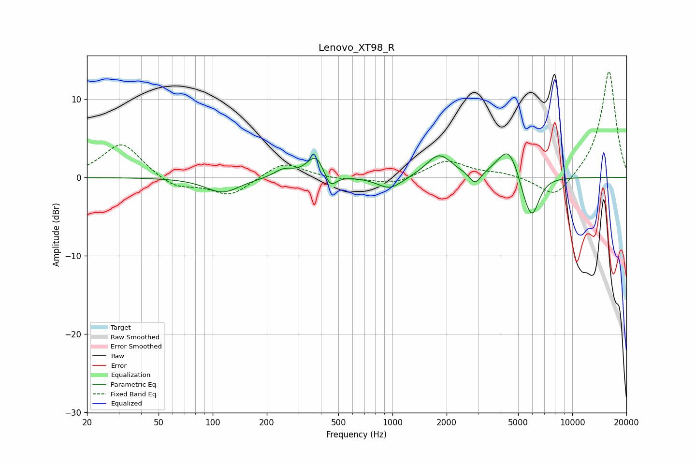

# Lenovo_XT98_R
See [usage instructions](https://github.com/jaakkopasanen/AutoEq#usage) for more options and info.

### Parametric EQs
Apply preamp of -3.1 dB when using parametric equalizer.

|   # | Type    |   Fc (Hz) |    Q |   Gain (dB) |
|-----|---------|-----------|------|-------------|
|   1 | Peaking |       114 | 1.5  |        -1.9 |
|   2 | Peaking |       249 | 2.58 |         1   |
|   3 | Peaking |       376 | 2.86 |         3   |
|   4 | Peaking |       449 | 4.14 |        -2.1 |
|   5 | Peaking |       969 | 2.03 |        -1.6 |
|   6 | Peaking |      1816 | 2.03 |         2.9 |
|   7 | Peaking |      2882 | 4.38 |        -1.7 |
|   8 | Peaking |      4438 | 2.22 |         4.2 |
|   9 | Peaking |      5480 | 3.09 |        -2.2 |
|  10 | Peaking |      6011 | 3.5  |        -4.3 |

### Fixed Band EQs
When using fixed band (also called graphic) equalizer, apply preamp of **-13.6 dB** (if available) and set gains manually with these parameters.

|   # | Type    |   Fc (Hz) |    Q |   Gain (dB) |
|-----|---------|-----------|------|-------------|
|   1 | Peaking |        31 | 1.41 |         4.5 |
|   2 | Peaking |        62 | 1.41 |        -1.5 |
|   3 | Peaking |       125 | 1.41 |        -2.3 |
|   4 | Peaking |       250 | 1.41 |         2.1 |
|   5 | Peaking |       500 | 1.41 |        -0.3 |
|   6 | Peaking |      1000 | 1.41 |        -0.9 |
|   7 | Peaking |      2000 | 1.41 |         2.2 |
|   8 | Peaking |      4000 | 1.41 |         0.5 |
|   9 | Peaking |      8000 | 1.41 |        -2.9 |
|  10 | Peaking |     16000 | 1.41 |        13.7 |

### Graphs

