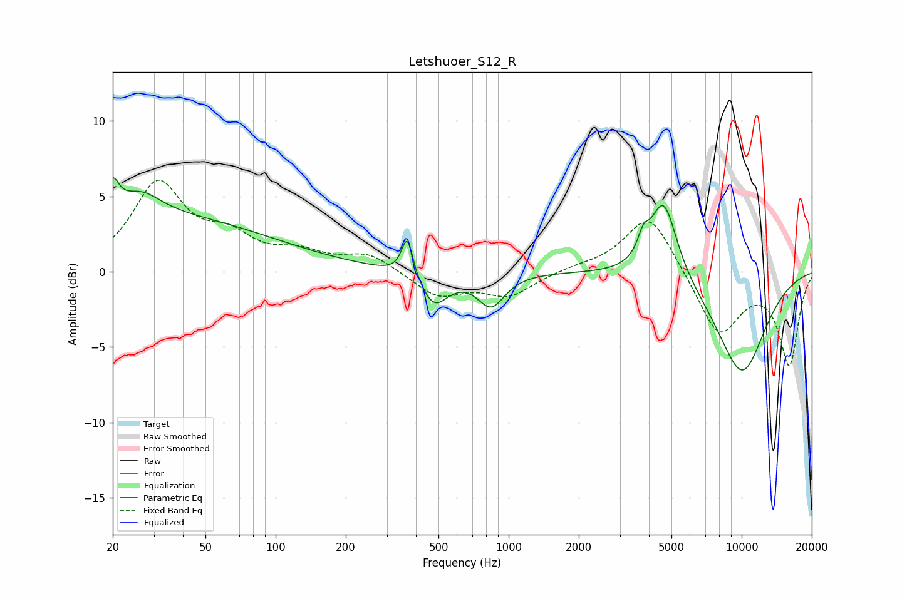

# Letshuoer_S12_R
See [usage instructions](https://github.com/jaakkopasanen/AutoEq#usage) for more options and info.

### Parametric EQs
Apply preamp of -6.3 dB when using parametric equalizer.

|   # | Type    |   Fc (Hz) |    Q |   Gain (dB) |
|-----|---------|-----------|------|-------------|
|   1 | Peaking |        20 | 5.69 |         1.8 |
|   2 | Peaking |        24 | 0.22 |         3.8 |
|   3 | Peaking |        27 | 1.73 |         1.4 |
|   4 | Peaking |       367 | 5.89 |         2.7 |
|   5 | Peaking |       481 | 2.45 |        -3   |
|   6 | Peaking |       486 | 2.73 |         0.8 |
|   7 | Peaking |       841 | 2.43 |        -2.2 |
|   8 | Peaking |      3785 | 6    |         1.3 |
|   9 | Peaking |      4624 | 2.39 |         5.3 |
|  10 | Peaking |     10000 | 1.1  |        -6.7 |

### Fixed Band EQs
When using fixed band (also called graphic) equalizer, apply preamp of **-6.2 dB** (if available) and set gains manually with these parameters.

|   # | Type    |   Fc (Hz) |    Q |   Gain (dB) |
|-----|---------|-----------|------|-------------|
|   1 | Peaking |        31 | 1.41 |         5.7 |
|   2 | Peaking |        62 | 1.41 |         1.9 |
|   3 | Peaking |       125 | 1.41 |         1   |
|   4 | Peaking |       250 | 1.41 |         1.1 |
|   5 | Peaking |       500 | 1.41 |        -1.6 |
|   6 | Peaking |      1000 | 1.41 |        -1.5 |
|   7 | Peaking |      2000 | 1.41 |         0.3 |
|   8 | Peaking |      4000 | 1.41 |         4   |
|   9 | Peaking |      8000 | 1.41 |        -4.2 |
|  10 | Peaking |     16000 | 1.41 |        -6.1 |

### Graphs

