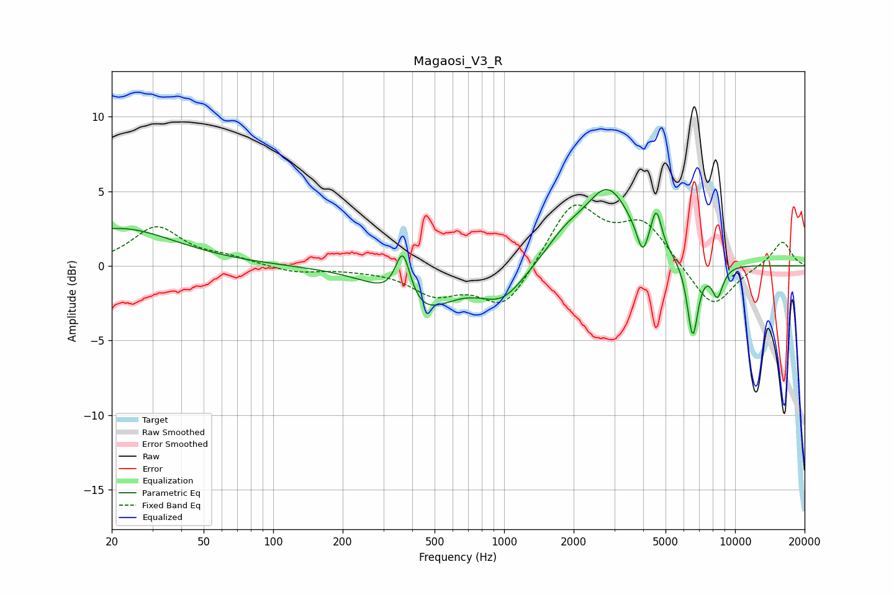

# Magaosi_V3_R
See [usage instructions](https://github.com/jaakkopasanen/AutoEq#usage) for more options and info.

### Parametric EQs
Apply preamp of -5.2 dB when using parametric equalizer.

|   # | Type    |   Fc (Hz) |    Q |   Gain (dB) |
|-----|---------|-----------|------|-------------|
|   1 | Peaking |        21 | 0.58 |         2.5 |
|   2 | Peaking |       364 | 4.27 |         3.5 |
|   3 | Peaking |       428 | 1.02 |        -3.1 |
|   4 | Peaking |       982 | 1.43 |        -2.1 |
|   5 | Peaking |      1834 | 1.62 |         1.4 |
|   6 | Peaking |      2821 | 1.37 |         5   |
|   7 | Peaking |      3978 | 5.93 |        -1.8 |
|   8 | Peaking |      4560 | 6    |         2.6 |
|   9 | Peaking |      6553 | 5.75 |        -5   |
|  10 | Peaking |      8386 | 5.23 |        -2   |

### Fixed Band EQs
When using fixed band (also called graphic) equalizer, apply preamp of **-4.2 dB** (if available) and set gains manually with these parameters.

|   # | Type    |   Fc (Hz) |    Q |   Gain (dB) |
|-----|---------|-----------|------|-------------|
|   1 | Peaking |        31 | 1.41 |         2.6 |
|   2 | Peaking |        62 | 1.41 |         0.5 |
|   3 | Peaking |       125 | 1.41 |        -0.5 |
|   4 | Peaking |       250 | 1.41 |        -0.1 |
|   5 | Peaking |       500 | 1.41 |        -1.7 |
|   6 | Peaking |      1000 | 1.41 |        -2.9 |
|   7 | Peaking |      2000 | 1.41 |         4.2 |
|   8 | Peaking |      4000 | 1.41 |         2.8 |
|   9 | Peaking |      8000 | 1.41 |        -3   |
|  10 | Peaking |     16000 | 1.41 |         1.7 |

### Graphs

