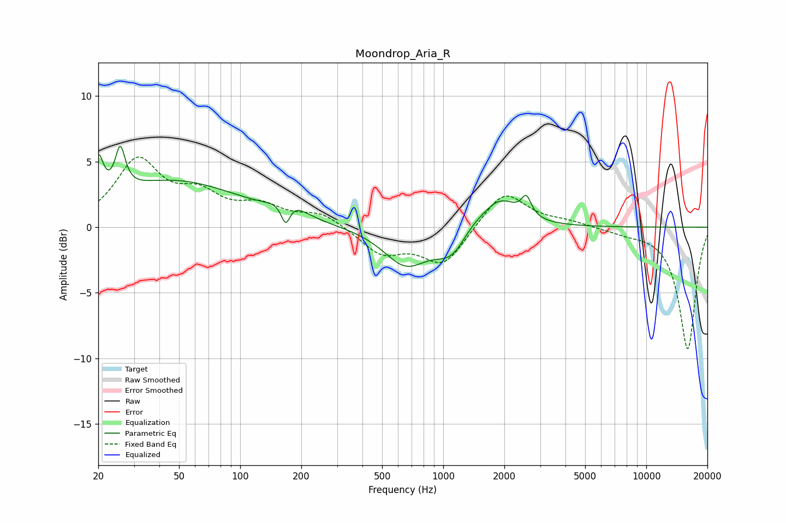

# Moondrop_Aria_R
See [usage instructions](https://github.com/jaakkopasanen/AutoEq#usage) for more options and info.

### Parametric EQs
Apply preamp of -6.3 dB when using parametric equalizer.

|   # | Type    |   Fc (Hz) |    Q |   Gain (dB) |
|-----|---------|-----------|------|-------------|
|   1 | Peaking |        20 | 5.93 |         3.1 |
|   2 | Peaking |        26 | 5.99 |         3.2 |
|   3 | Peaking |        47 | 0.42 |         3.5 |
|   4 | Peaking |       168 | 6    |        -1.9 |
|   5 | Peaking |       173 | 2.07 |         1.2 |
|   6 | Peaking |       653 | 1.3  |        -2.8 |
|   7 | Peaking |      1101 | 1.75 |        -2   |
|   8 | Peaking |      1373 | 2.42 |         0.5 |
|   9 | Peaking |      1892 | 1.54 |         2.4 |
|  10 | Peaking |      2567 | 5.99 |         1.4 |

### Fixed Band EQs
When using fixed band (also called graphic) equalizer, apply preamp of **-5.5 dB** (if available) and set gains manually with these parameters.

|   # | Type    |   Fc (Hz) |    Q |   Gain (dB) |
|-----|---------|-----------|------|-------------|
|   1 | Peaking |        31 | 1.41 |         4.9 |
|   2 | Peaking |        62 | 1.41 |         2.1 |
|   3 | Peaking |       125 | 1.41 |         1.4 |
|   4 | Peaking |       250 | 1.41 |         1   |
|   5 | Peaking |       500 | 1.41 |        -2   |
|   6 | Peaking |      1000 | 1.41 |        -2.9 |
|   7 | Peaking |      2000 | 1.41 |         2.9 |
|   8 | Peaking |      4000 | 1.41 |         0.4 |
|   9 | Peaking |      8000 | 1.41 |        -0.3 |
|  10 | Peaking |     16000 | 1.41 |        -9.3 |

### Graphs

