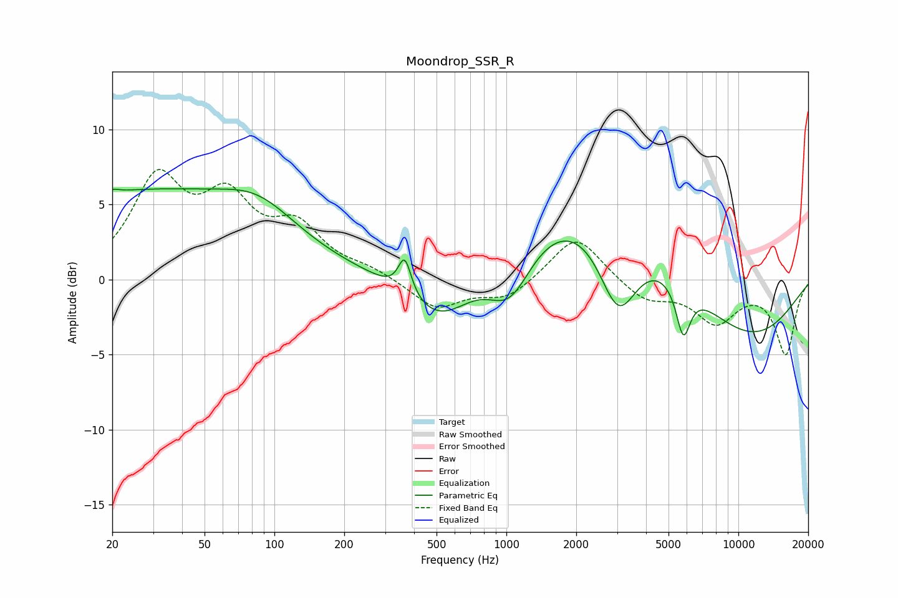

# Moondrop_SSR_R
See [usage instructions](https://github.com/jaakkopasanen/AutoEq#usage) for more options and info.

### Parametric EQs
Apply preamp of -6.1 dB when using parametric equalizer.

|   # | Type    |   Fc (Hz) |    Q |   Gain (dB) |
|-----|---------|-----------|------|-------------|
|   1 | Peaking |        20 | 5.09 |         0.2 |
|   2 | Peaking |        26 | 0.25 |         5.7 |
|   3 | Peaking |        86 | 0.87 |         2   |
|   4 | Peaking |       365 | 5.1  |         2.5 |
|   5 | Peaking |       519 | 0.9  |        -4.1 |
|   6 | Peaking |      1036 | 1.41 |        -4   |
|   7 | Peaking |      2307 | 0.3  |         6.2 |
|   8 | Peaking |      3037 | 1.64 |        -5.8 |
|   9 | Peaking |      5787 | 4.44 |        -3.4 |
|  10 | Peaking |      9915 | 0.44 |        -4.9 |

### Fixed Band EQs
When using fixed band (also called graphic) equalizer, apply preamp of **-7.4 dB** (if available) and set gains manually with these parameters.

|   # | Type    |   Fc (Hz) |    Q |   Gain (dB) |
|-----|---------|-----------|------|-------------|
|   1 | Peaking |        31 | 1.41 |         6.3 |
|   2 | Peaking |        62 | 1.41 |         4.6 |
|   3 | Peaking |       125 | 1.41 |         3.1 |
|   4 | Peaking |       250 | 1.41 |         0.6 |
|   5 | Peaking |       500 | 1.41 |        -1.9 |
|   6 | Peaking |      1000 | 1.41 |        -1.3 |
|   7 | Peaking |      2000 | 1.41 |         3.1 |
|   8 | Peaking |      4000 | 1.41 |        -1.4 |
|   9 | Peaking |      8000 | 1.41 |        -2.7 |
|  10 | Peaking |     16000 | 1.41 |        -4.9 |

### Graphs

