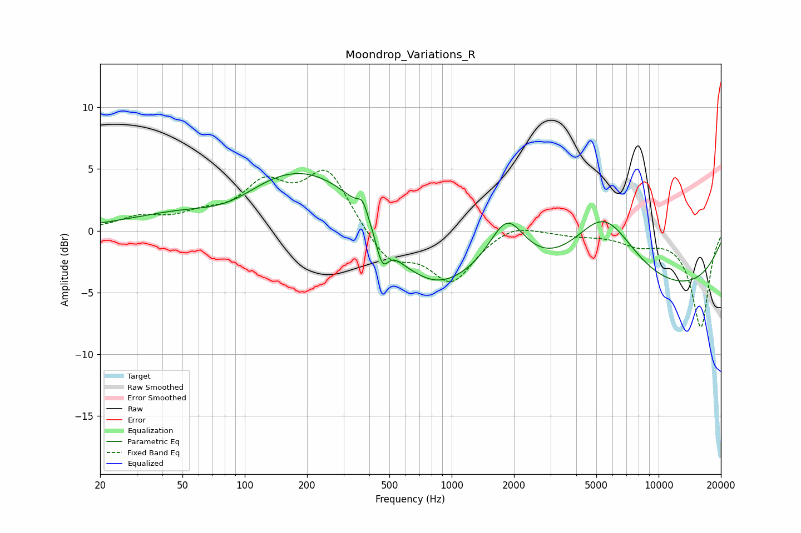

# Moondrop_Variations_R
See [usage instructions](https://github.com/jaakkopasanen/AutoEq#usage) for more options and info.

### Parametric EQs
Apply preamp of -4.7 dB when using parametric equalizer.

|   # | Type    |   Fc (Hz) |    Q |   Gain (dB) |
|-----|---------|-----------|------|-------------|
|   1 | Peaking |        42 | 0.56 |         0.6 |
|   2 | Peaking |        85 | 0.83 |        -1.8 |
|   3 | Peaking |       185 | 0.38 |         5.8 |
|   4 | Peaking |       371 | 6    |         1.1 |
|   5 | Peaking |       462 | 4.56 |        -2.6 |
|   6 | Peaking |       584 | 2.59 |        -0.3 |
|   7 | Peaking |       773 | 0.71 |        -4.9 |
|   8 | Peaking |      1852 | 1.62 |         4.3 |
|   9 | Peaking |      5435 | 0.9  |         6   |
|  10 | Peaking |      7507 | 0.19 |        -5.4 |

### Fixed Band EQs
When using fixed band (also called graphic) equalizer, apply preamp of **-5.0 dB** (if available) and set gains manually with these parameters.

|   # | Type    |   Fc (Hz) |    Q |   Gain (dB) |
|-----|---------|-----------|------|-------------|
|   1 | Peaking |        31 | 1.41 |         1   |
|   2 | Peaking |        62 | 1.41 |         1   |
|   3 | Peaking |       125 | 1.41 |         3.4 |
|   4 | Peaking |       250 | 1.41 |         4.8 |
|   5 | Peaking |       500 | 1.41 |        -2.6 |
|   6 | Peaking |      1000 | 1.41 |        -4   |
|   7 | Peaking |      2000 | 1.41 |         0.8 |
|   8 | Peaking |      4000 | 1.41 |        -0.3 |
|   9 | Peaking |      8000 | 1.41 |        -1   |
|  10 | Peaking |     16000 | 1.41 |        -7.8 |

### Graphs

