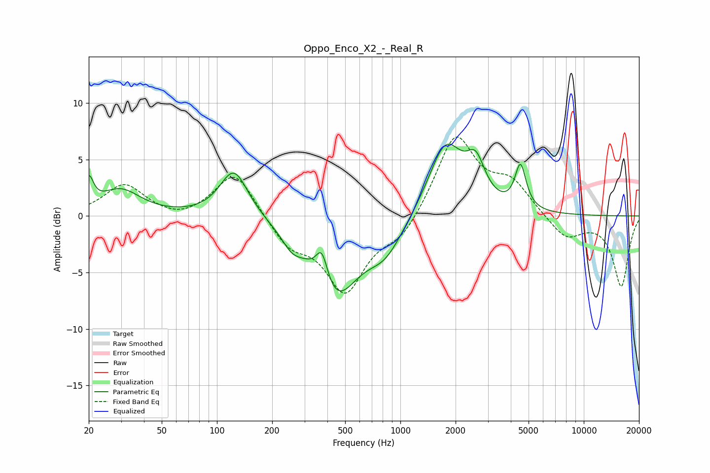

# Oppo_Enco_X2_-_Real_R
See [usage instructions](https://github.com/jaakkopasanen/AutoEq#usage) for more options and info.

### Parametric EQs
Apply preamp of -6.5 dB when using parametric equalizer.

|   # | Type    |   Fc (Hz) |    Q |   Gain (dB) |
|-----|---------|-----------|------|-------------|
|   1 | Peaking |        20 | 5.76 |         2.5 |
|   2 | Peaking |        30 | 1.3  |         2.3 |
|   3 | Peaking |       124 | 1.85 |         4.3 |
|   4 | Peaking |       257 | 2.39 |        -1.4 |
|   5 | Peaking |       373 | 4.38 |         2.8 |
|   6 | Peaking |       443 | 1.15 |        -6.8 |
|   7 | Peaking |       826 | 1.39 |        -2.7 |
|   8 | Peaking |      1765 | 1.48 |         6.5 |
|   9 | Peaking |      2580 | 2.82 |         3.2 |
|  10 | Peaking |      4518 | 4.73 |         3.9 |

### Fixed Band EQs
When using fixed band (also called graphic) equalizer, apply preamp of **-7.1 dB** (if available) and set gains manually with these parameters.

|   # | Type    |   Fc (Hz) |    Q |   Gain (dB) |
|-----|---------|-----------|------|-------------|
|   1 | Peaking |        31 | 1.41 |         2.8 |
|   2 | Peaking |        62 | 1.41 |        -0.5 |
|   3 | Peaking |       125 | 1.41 |         4.1 |
|   4 | Peaking |       250 | 1.41 |        -2.4 |
|   5 | Peaking |       500 | 1.41 |        -6.5 |
|   6 | Peaking |      1000 | 1.41 |        -1.9 |
|   7 | Peaking |      2000 | 1.41 |         7.2 |
|   8 | Peaking |      4000 | 1.41 |         2.6 |
|   9 | Peaking |      8000 | 1.41 |        -2   |
|  10 | Peaking |     16000 | 1.41 |        -6.2 |

### Graphs

