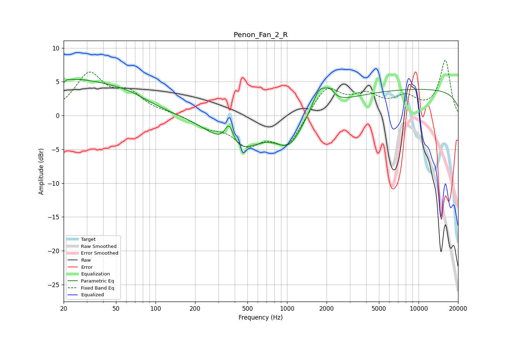

# Penon_Fan_2_R
See [usage instructions](https://github.com/jaakkopasanen/AutoEq#usage) for more options and info.

### Parametric EQs
Apply preamp of -5.5 dB when using parametric equalizer.

|   # | Type    |   Fc (Hz) |    Q |   Gain (dB) |
|-----|---------|-----------|------|-------------|
|   1 | Peaking |        20 | 6    |        -3.7 |
|   2 | Peaking |        20 | 5.77 |         3.3 |
|   3 | Peaking |        24 | 0.37 |         5.2 |
|   4 | Peaking |        64 | 1.04 |         0.8 |
|   5 | Peaking |       362 | 4.27 |         3.1 |
|   6 | Peaking |       420 | 0.81 |        -5   |
|   7 | Peaking |      1037 | 1.42 |        -4.1 |
|   8 | Peaking |      1768 | 2.49 |         3.5 |
|   9 | Peaking |      2123 | 4.35 |         1.2 |
|  10 | Peaking |     10000 | 0.18 |         3.9 |

### Fixed Band EQs
When using fixed band (also called graphic) equalizer, apply preamp of **-8.3 dB** (if available) and set gains manually with these parameters.

|   # | Type    |   Fc (Hz) |    Q |   Gain (dB) |
|-----|---------|-----------|------|-------------|
|   1 | Peaking |        31 | 1.41 |         5.9 |
|   2 | Peaking |        62 | 1.41 |         2.9 |
|   3 | Peaking |       125 | 1.41 |         0.3 |
|   4 | Peaking |       250 | 1.41 |        -1.5 |
|   5 | Peaking |       500 | 1.41 |        -3.8 |
|   6 | Peaking |      1000 | 1.41 |        -4.4 |
|   7 | Peaking |      2000 | 1.41 |         4.3 |
|   8 | Peaking |      4000 | 1.41 |         2.6 |
|   9 | Peaking |      8000 | 1.41 |         2.3 |
|  10 | Peaking |     16000 | 1.41 |         8.1 |

### Graphs

