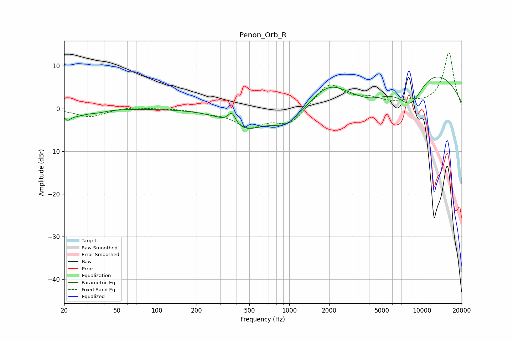

# Penon_Orb_R
See [usage instructions](https://github.com/jaakkopasanen/AutoEq#usage) for more options and info.

### Parametric EQs
Apply preamp of -7.5 dB when using parametric equalizer.

|   # | Type    |   Fc (Hz) |    Q |   Gain (dB) |
|-----|---------|-----------|------|-------------|
|   1 | Peaking |        21 | 5.6  |        -1.6 |
|   2 | Peaking |        25 | 1.77 |        -1.4 |
|   3 | Peaking |        36 | 2.35 |        -0.5 |
|   4 | Peaking |       369 | 5.12 |         2.7 |
|   5 | Peaking |       462 | 1.03 |        -4.4 |
|   6 | Peaking |       960 | 1.21 |        -4.1 |
|   7 | Peaking |      1992 | 1.02 |         4.7 |
|   8 | Peaking |      4152 | 0.87 |        -3.6 |
|   9 | Peaking |      8254 | 1.22 |        -8.4 |
|  10 | Peaking |      9672 | 0.33 |        10.9 |

### Fixed Band EQs
When using fixed band (also called graphic) equalizer, apply preamp of **-13.2 dB** (if available) and set gains manually with these parameters.

|   # | Type    |   Fc (Hz) |    Q |   Gain (dB) |
|-----|---------|-----------|------|-------------|
|   1 | Peaking |        31 | 1.41 |        -2   |
|   2 | Peaking |        62 | 1.41 |         0.5 |
|   3 | Peaking |       125 | 1.41 |         0.1 |
|   4 | Peaking |       250 | 1.41 |        -0.7 |
|   5 | Peaking |       500 | 1.41 |        -4   |
|   6 | Peaking |      1000 | 1.41 |        -3.7 |
|   7 | Peaking |      2000 | 1.41 |         5.9 |
|   8 | Peaking |      4000 | 1.41 |         1.8 |
|   9 | Peaking |      8000 | 1.41 |         1   |
|  10 | Peaking |     16000 | 1.41 |        13.1 |

### Graphs

